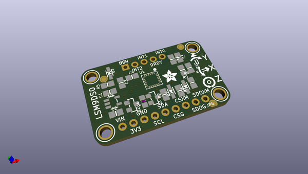
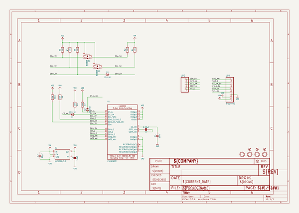
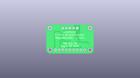
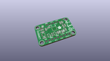
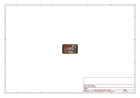
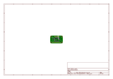
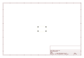
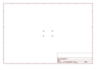
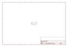

# OOMP Project  
## Adafruit-LSM9DS0-PCB  by adafruit  
  
oomp key: oomp_projects_flat_adafruit_adafruit_lsm9ds0_pcb  
(snippet of original readme)  
  
- Adafruit LSM9DS0 PCB (Discontinued)  
<a href="http://www.adafruit.com/products/2021">   
Click here to purchase one from the Adafruit shop</a>  
  
When we saw the new LSM9DS0 from ST micro we thought - wow this could really make for a great breakout, at a very nice price! Design your own activity or motion tracker with all the data... We spun up a breakout board that has all the extra circuitry you'll want, like a 3V regulator and level shifting circuitry so it can be used by 3V or 5V power/logic microcontrollers like the Arduino.  
  
PCB files for Adafruit LSM9DS0 9-DOF Sensor PCB. The format is EagleCAD schematic and board layout.  
- https://www.adafruit.com/products/2021  
  
--- License  
  
Adafruit invests time and resources providing this open source design, please support Adafruit and open-source hardware by purchasing products from [Adafruit](https://www.adafruit.com)!  
  
All text above must be included in any redistribution  
  
Designed by Limor Fried/Ladyada for Adafruit Industries.  
Creative Commons Attribution/Share-Alike, all text above must be included in any redistribution.   
See license.txt for additional information.  
  
  full source readme at [readme_src.md](readme_src.md)  
  
source repo at: [https://github.com/adafruit/Adafruit-LSM9DS0-PCB](https://github.com/adafruit/Adafruit-LSM9DS0-PCB)  
## Board  
  
  
## Schematic  
  
  
  
[schematic pdf](working_schematic.pdf)  
## Images  
  
  
  
  
  
  
  
  
  
  
  
  
  
  
  
  
