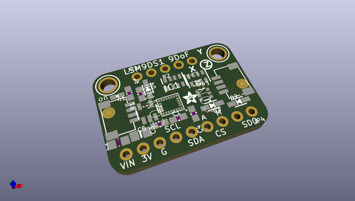
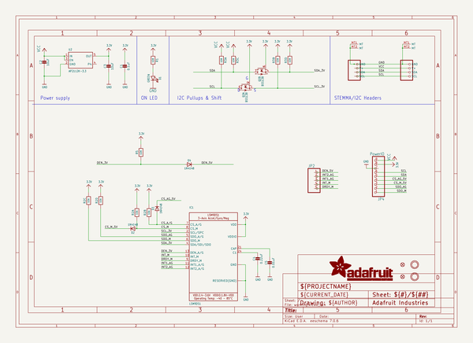
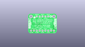
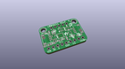
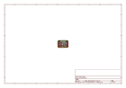
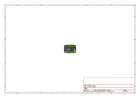
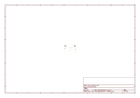
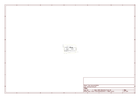

# OOMP Project  
## Adafruit-LSM9DS1-Breakout-PCB  by adafruit  
  
(snippet of original readme)  
  
-- Adafruit LSM9DS1 Breakout PCB  
  
<a href="http://www.adafruit.com/products/3387">   
Click here to purchase one from the Adafruit shop</a>  
  
PCB files for the Adafruit LSM9DS1 Breakout. Format is EagleCAD schematic and board layout  
* https://www.adafruit.com/product/3387  
  
--- Description  
  
Add motion, direction and orientation sensing to your Arduino project with this all-in-one 9-DOF sensor. Inside the chip are three sensors, one is a classic 3-axis accelerometer, which can tell you which direction is down towards the Earth (by measuring gravity) or how fast the board is accelerating in 3D space. The other is a 3-axis magnetometer that can sense where the strongest magnetic force is coming from, generally used to detect magnetic north. The third is a 3-axis gyroscope that can measure spin and twist. By combining this data you can REALLY orient yourself.  
  
We've carried the LSM9DS0 from ST for a while, and the LSM9DS1 is their latest offering. We thought this could really make for a great breakout, at a very nice price! Design your own activity or motion tracker with all the data... We spun up a breakout board that has all the extra circuitry you'll want, for use with an Arduino (or other microcontroller).  
  
--- License  
  
Adafruit invests time and resources providing this open source design, please support Adafruit and open-source hardware by purchasing products from [Adafruit](https://www.adafruit.com)!  
  
Designed by Limor Frie  
  full source readme at [readme_src.md](readme_src.md)  
  
source repo at: [https://github.com/adafruit/Adafruit-LSM9DS1-Breakout-PCB](https://github.com/adafruit/Adafruit-LSM9DS1-Breakout-PCB)  
## Board  
  
  
## Schematic  
  
  
  
[schematic pdf](working_schematic.pdf)  
## Images  
  
  
  
  
  
  
  
  
  
  
  
  
  
  
  
  
