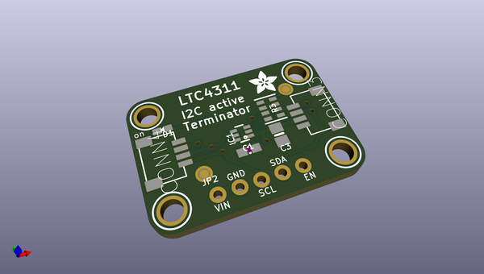
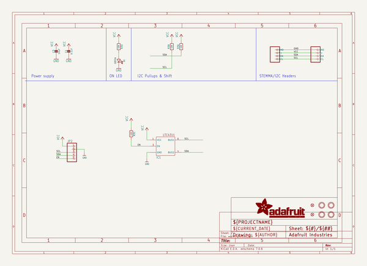

# OOMP Project  
## Adafruit-LTC4311-PCB  by adafruit  
  
oomp key: oomp_projects_flat_adafruit_adafruit_ltc4311_pcb  
(snippet of original readme)  
  
-- Adafruit LTC4311 I2C Extender / Active Terminator PCB  
  
<a href="http://www.adafruit.com/products/4756">   
Click here to purchase one from the Adafruit shop</a>  
  
PCB files for the Adafruit LTC4311 I2C Extender / Active Terminator.  
  
Format is EagleCAD schematic and board layout  
* https://www.adafruit.com/product/4756  
  
--- Description  
  
I2C stands for Inter-Integrated-Circuit communications, its meant for short distances on a PCB or subassembly. But, hey, we're engineers and we like to push the limits of technology, right? So why not try to have I2C run over a meter long cable, or even longer? Well, if you try to do that you'll quickly find that the length of the cable adds capacitance and resistance that slows down the open-drain pullups used in I2C, making it hard to use 100KHz+ clock speeds. You could try slowing down your I2C clock to 1 KHz...or you could use an Adafruit LTC4311 active terminator like this one!  
  
Using this board is easy: connect it to your I2C bus at the beginning of the chain (if you don't have a massively long cable, you can also try at the end of the chain). When the chip is powered and enabled, it will watch the SCL and SDA lines. When it sees them being pulled up through the I2C resistors, it will activate and dump in some current to give it a boost thru to the top power rail.  
  
You can now achieve much faster data rates without having to noodle with resistors, and over long cables. We ran a 400 KHz   
  full source readme at [readme_src.md](readme_src.md)  
  
source repo at: [https://github.com/adafruit/Adafruit-LTC4311-PCB](https://github.com/adafruit/Adafruit-LTC4311-PCB)  
## Board  
  
  
## Schematic  
  
  
  
[schematic pdf](working_schematic.pdf)  
## Images  
  
  
  
  
  
  
  
  
  
  
  
  
  
  
  
  
