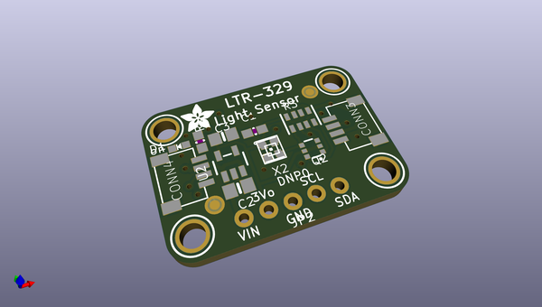
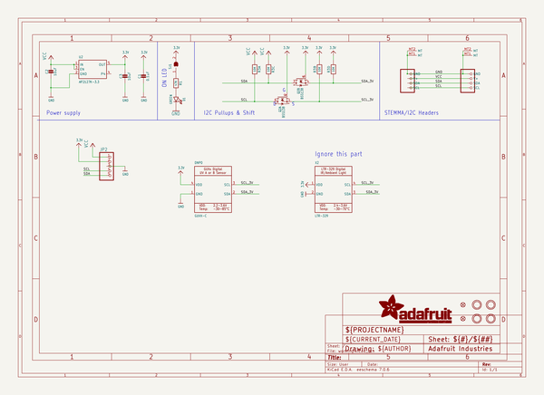
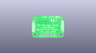
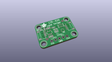
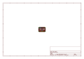
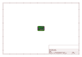
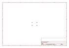
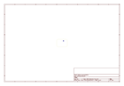
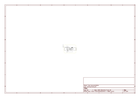
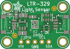

# OOMP Project  
## Adafruit-LTR-329-LTR-303-PCB  by adafruit  
  
(snippet of original readme)  
  
-- Adafruit LTR-329 and LTR-303 Light Sensor PCBs  
  
<a href="http://www.adafruit.com/products/5591">   
Click here to purchase one from the Adafruit shop</a>  
  
<a href="http://www.adafruit.com/products/5610">   
Click here to purchase one from the Adafruit shop</a>  
  
PCB files for the Adafruit LTR-329 and LTR-303 Light Sensor.   
  
Format is EagleCAD schematic and board layout  
* https://www.adafruit.com/product/5591  
* https://www.adafruit.com/product/5610  
  
--- Description  
  
The Adafruit LTR-303 and LTR-329 Light Sensors are simple and popular low-cost I2C digital light sensors that are easy to integrate into your project for reliable and wide-ranging light measurements.  
  
Perfect for a wide range of project use cases: Should we turn up the brightness of our display or dim it to save power? Which direction should your robot move to stay in an area with the most light? Is it day or night? All of these questions can be answered with the help of the LTR-303 and LTR-329. They're small, capable and inexpensive light sensors that you can include in your next project to add the detection and measurement of light.  
  
They provide 16-bit light measurements for both Infrared and Visible+IR spectrums. Subtract one from the other to get human-visible light. Thanks to configurable gain and integration time settings, the LTR-303 can measure from 0 to 65K+ lux.  
  
The 303 also comes with alert and IRQ  
  full source readme at [readme_src.md](readme_src.md)  
  
source repo at: [https://github.com/adafruit/Adafruit-LTR-329-LTR-303-PCB](https://github.com/adafruit/Adafruit-LTR-329-LTR-303-PCB)  
## Board  
  
  
## Schematic  
  
  
  
[schematic pdf](working_schematic.pdf)  
## Images  
  
  
  
  
  
  
  
  
  
  
  
  
  
  
  
  
  
  
