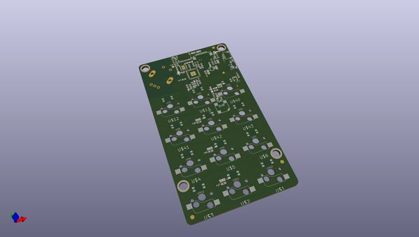
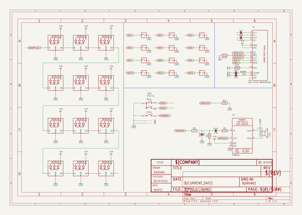

# OOMP Project  
## Adafruit-MacroPad-RP2040-PCB  by adafruit  
  
(snippet of original readme)  
  
-- Adafruit MacroPad RP2040 PCB  
  
<a href="http://www.adafruit.com/products/5100">   
Click here to purchase one from the Adafruit shop</a>  
  
PCB files for the Adafruit MacroPad RP2040.   
  
Format is EagleCAD schematic and board layout  
* https://www.adafruit.com/product/5100  
  
--- Description  
  
Strap yourself in, we're launching in T-minus 10 seconds...Destination? A new Class M planet called MACROPAD! M here, stands for Microcontroller because this 3x4 keyboard controller features the newest technology from the Raspberry Pi sector: say hello to the RP2040. It's speedy little microcontroller with lots of GPIO pins and a 64 times more RAM than the Apollo Guidance Computer. We added 8 MB of flash memory for plenty of storage.  
  
This is just the bare MACROPAD PCB assembly! Many folks in the mechanical keyboard community like to customize the keys and keycaps of their keebs, so this is sold 'bare bones' here. To use as a full product you'll need to add 12 MX-compatible key switches and matching key caps.  
  
Get ready to upgrade your desk's mission control station with a CircuitPython or Arduino powered Macropad - complete with 12 buttons, OLED display, speaker and rotary encoder. Customize it for your spacecraft to help guide you through the great reaches of the unknown. (Or just have it type out your favorite emojis.)  
  
Each of the 12 sockets can accept a Cherry MX-compatible key switch. No soldering required, just snap it in! Use any ke  
  full source readme at [readme_src.md](readme_src.md)  
  
source repo at: [https://github.com/adafruit/Adafruit-MacroPad-RP2040-PCB](https://github.com/adafruit/Adafruit-MacroPad-RP2040-PCB)  
## Board  
  
  
## Schematic  
  
  
  
[schematic pdf](working_schematic.pdf)  
## Images  
