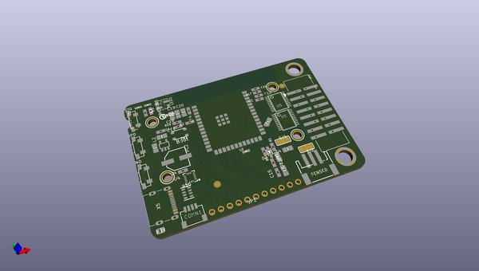
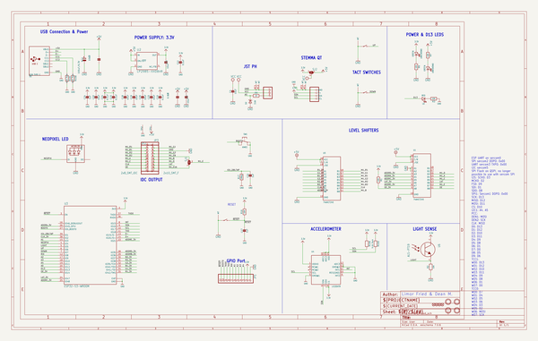
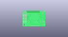
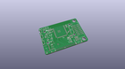
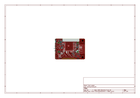
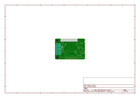
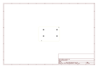
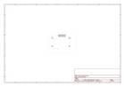
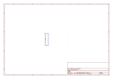
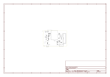

# OOMP Project  
## Adafruit-MatrixPortal-S3-PCB  by adafruit  
  
(snippet of original readme)  
  
-- Adafruit Matrix Portal S3 CircuitPython Powered Internet Display PCB  
  
<a href="http://www.adafruit.com/products/5778">   
Click here to purchase one from the Adafruit shop</a>  
  
PCB files for the Adafruit Matrix Portal S3 CircuitPython Powered Internet Display.  
  
Format is EagleCAD schematic and board layout  
* https://www.adafruit.com/product/5778  
  
--- Description  
  
Folks love our [wide selection of RGB matrices](https://www.adafruit.com/category/327) and accessories for making custom colorful LED displays... and our RGB Matrix Shields and FeatherWings can be quickly soldered together to make the wiring much easier. But what if we made it *even easier* than that? **Like, no solder, no wiring, just instant plug-and-play?** Dream no more - with the **Adafruit Matrix Portal S3 add-on for RGB Matrices**, there's never been an easier way to create powerful Internet-connected LED displays.  
  
You can plug directly into the back of [any HUB-75 compatible display (all the ones we stock will work) from 16x32 up to 64x64](https://www.adafruit.com/category/327) or use the stock 2x8 IDC cables to plug into the front. Use the included screws to attach the power cable to the power plugs with a common screwdriver, then power it with any USB C power supply. Chain dozens of displays for long stretches, or you can panelize them in a grid for bigger displays. For larger projects, power the matrices with a separate 5V power adapter.  
  
Then code up  
  full source readme at [readme_src.md](readme_src.md)  
  
source repo at: [https://github.com/adafruit/Adafruit-MatrixPortal-S3-PCB](https://github.com/adafruit/Adafruit-MatrixPortal-S3-PCB)  
## Board  
  
  
## Schematic  
  
  
  
[schematic pdf](working_schematic.pdf)  
## Images  
  
  
  
  
  
  
  
  
  
  
  
  
  
  
  
  
