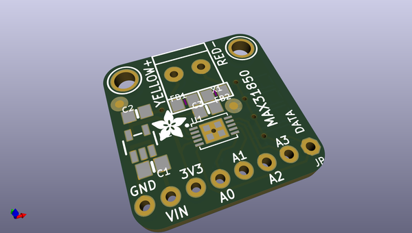
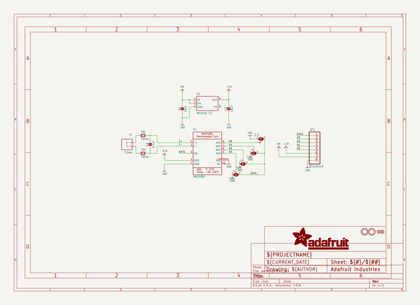
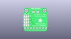
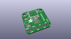
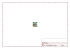
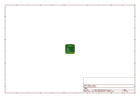
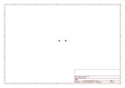
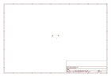
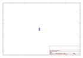
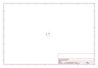

# OOMP Project  
## Adafruit-MAX31850-thermocouple-breakout-board  by adafruit  
  
(snippet of original readme)  
  
- PCB files for Adafruit MAX31850 1-Wire Thermocouple Breakout Board  
  
<a href="http://www.adafruit.com/products/1727"> Click here to purchase one from the Adafruit shop</a>  
  
Thermocouples are very sensitive, requiring a good amplifier with a cold-compensation reference. [So far we've carried the very nice MAX31855 which is an SPI interface thermocouple amplifier](https://www.adafruit.com/products/269). The '855 is great but if you have a lot of thermocouples to measure it isn't terribly easy to use. That's why we are also carrying the new '850 model from Maxim - it's a "1-Wire" thermocouple amp which can have any number of breakouts on a single shared I/O line.  
  
The MAX31850K does everything for you, and can be easily interfaced with any microcontroller that has 1-Wire support. This breakout board has the chip itself, a 3.3V regulator with 10uF bypass capacitors all assembled and tested. This board can be used with 'parasitic power' - where the power is on the data line - or with 'local power' where the power for the converter comes in on the Vin Pin.  
  
Please note: this board does not have level shifting on the 3V Data line - we did this on purpose so that it can be used in parasitic mode. The data line must be level shifted to [3V - our 4-channel shifter works wonderfully for level shifting 1-Wire](http://www.adafruit.com/products/757) and you only need one at the '1-Wire host' for all thermocouples on the shared data li  
  full source readme at [readme_src.md](readme_src.md)  
  
source repo at: [https://github.com/adafruit/Adafruit-MAX31850-thermocouple-breakout-board](https://github.com/adafruit/Adafruit-MAX31850-thermocouple-breakout-board)  
## Board  
  
  
## Schematic  
  
  
  
[schematic pdf](working_schematic.pdf)  
## Images  
  
  
  
  
  
  
  
  
  
  
  
  
  
  
  
  
