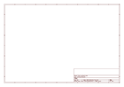

# OOMP Project  
## Adafruit-MAX31855-breakout-board  by adafruit  
  
(snippet of original readme)  
  
- Adafruit MAX31885 Thermocouple Amp breakout  
  
<a href="http://www.adafruit.com/products/269"> Click here to purchase one from the Adafruit shop</a>  
  
Thermocouples are very sensitive, requiring a good amplifier with a cold-compensation reference. The MAX31855K does everything for you, and can be easily interfaced with any microcontroller, even one without an analog input. This breakout board has the chip itself, a 3.3V regulator with 10uF bypass capacitors and level shifting circuitry, all assembled and tested. Comes with a 2 pin terminal block (for connecting to the thermocouple) and pin header (to plug into any breadboard or perfboard). [Goes great with our 1m K-type thermocouple](http://www.adafruit.com/products/270).  
  
[If you need a thermocouple interface that can handle other types of thermocouples, check out our 'Universal' MAX31856 amplifier board which can be configured in the Arduino sketch to interface with just about any kind of thermocouple](https://www.adafruit.com/products/3263)  
  
-- License  
  
Adafruit invests time and resources providing this open source design,   
please support Adafruit and open-source hardware by purchasing   
products from Adafruit!  
  
All text above must be included in any redistribution  
  
Designed by Limor Fried/Ladyada for Adafruit Industries.  
Creative Commons Attribution/Share-Alike, all text above must be included in any redistribution  
  
  full source readme at [readme_src.md](readme_src.md)  
  
source repo at: [https://github.com/adafruit/Adafruit-MAX31855-breakout-board](https://github.com/adafruit/Adafruit-MAX31855-breakout-board)  
## Board  
  
  
## Schematic  
  
  
  
[schematic pdf](working_schematic.pdf)  
## Images  
  
  
  
  
  
  
  
  
  
  
  
  
  
  
  
  
