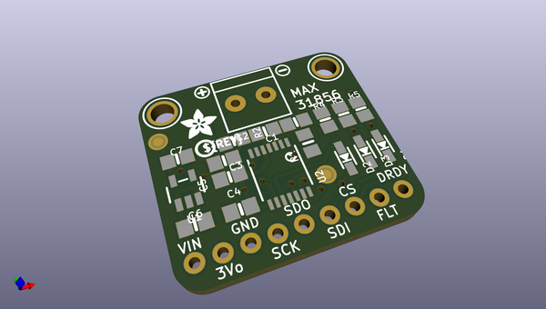
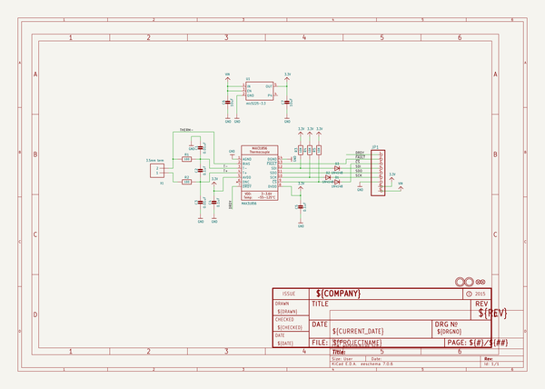
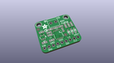
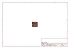
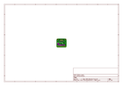
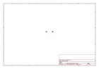
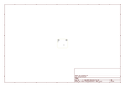
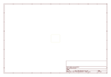
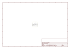

# OOMP Project  
## Adafruit-MAX31856-PCB  by adafruit  
  
(snippet of original readme)  
  
-- Adafruit MAX31856 PCB  
  
<a href="http://www.adafruit.com/products/3263">   
Click here to purchase one from the Adafruit shop</a>  
  
PCB files for the Adafruit MAX31856 Thermocouple Amplifier Breakout. Format is EagleCAD schematic and board layout  
* https://www.adafruit.com/product/3263  
  
--- Description  
  
Thermocouples are very sensitive, requiring a good amplifier with a cold-compensation reference, as well as calculations to handle any non-linearities. For a long time we've suggested our MAX31855K breakout, which works great but is only for K-type thermocouples. Now we're happy to offer a great new thermocouple amplifier/converter that can handle just about any type of thermocouple, and even has the ability to give you notification when the temperature goes out of range, or a fault occurs. Very fancy!  
  
This converter communicates over 4-wire SPI and can interface with any K, J, N, R, S, T, E, or B type thermocouple.  
  
This breakout does everything for you, and can be easily interfaced with any microcontroller, even one without an analog input. This breakout board has the chip itself, a 3.3V regulator and level shifting circuitry, all assembled and tested. Comes with a 2 pin terminal block (for connecting to the thermocouple) and pin header (to plug into any breadboard or perfboard). We even added inline resistors and a filter capacitor on-board for better stability, as recommended by Maxim. Goes great with our 1m K-type the  
  full source readme at [readme_src.md](readme_src.md)  
  
source repo at: [https://github.com/adafruit/Adafruit-MAX31856-PCB](https://github.com/adafruit/Adafruit-MAX31856-PCB)  
## Board  
  
  
## Schematic  
  
  
  
[schematic pdf](working_schematic.pdf)  
## Images  
  
  
  
  
  
  
  
  
  
  
  
  
  
  
  
  
