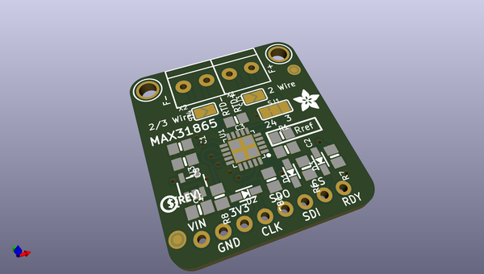
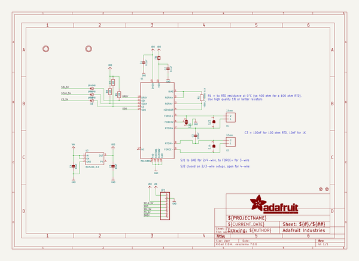
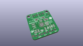
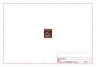
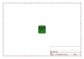
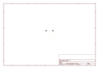
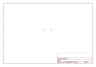
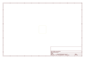
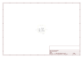
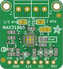

# OOMP Project  
## Adafruit-MAX31865-PCB  by adafruit  
  
oomp key: oomp_projects_flat_adafruit_adafruit_max31865_pcb  
(snippet of original readme)  
  
-- Adafruit MAX31865 PCB  
  
<a href="http://www.adafruit.com/products/3328">   
Click here to purchase one from the Adafruit shop</a>  
  
PCB files for the Adafruit MAX31865 RTD Sensor Breakout. Format is EagleCAD schematic and board layout  
* https://www.adafruit.com/product/3328  
  
--- Description  
  
For precision temperature sensing, nothing beats a Platinum RTD. Resistance temperature detectors (RTDs) are temperature sensors that contain a resistor that changes resistance value as its temperature changes, basically a kind of thermistor. In this sensor, the resistor is actually a small strip of Platinum with a resistance of 100 ohms at 0°C, thus the name PT100. Compared to most NTC/PTC thermistors, the PT type of RTD is much most stable and precise (but also more expensive) PT100's have been used for many years to measure temperature in laboratory and industrial processes, and have developed a reputation for accuracy (better than thermocouples), repeatability, and stability.   
  
However, to get that precision and accuracy out of your PT100 RTD you must use an amplifier that is designed to read the low resistance. Better yet, have an amplifier that can automatically adjust and compensate for the resistance of the connecting wires. If you're looking for a great RTD sensor, today is your lucky day because we have a lovely Adafruit RTD Sensor Amplifier with the MAX31865 breakout for use with any 2, 3 or 4 wire PT100 RTD!  
  
--- License  
  
A  
  full source readme at [readme_src.md](readme_src.md)  
  
source repo at: [https://github.com/adafruit/Adafruit-MAX31865-PCB](https://github.com/adafruit/Adafruit-MAX31865-PCB)  
## Board  
  
  
## Schematic  
  
  
  
[schematic pdf](working_schematic.pdf)  
## Images  
  
  
  
  
  
  
  
  
  
  
  
  
  
  
  
  
  
  
