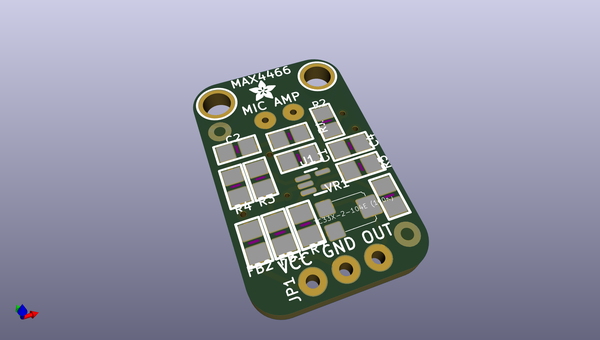
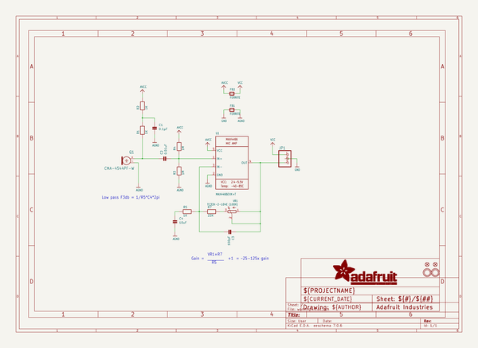
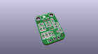
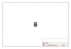
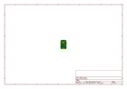
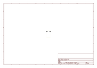
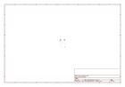
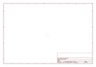
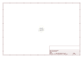

# OOMP Project  
## Adafruit-MAX4466-Electret-Mic-Amplifier-PCBs  by adafruit  
  
oomp key: oomp_projects_flat_adafruit_adafruit_max4466_electret_mic_amplifier_pcbs  
(snippet of original readme)  
  
- Adafruit MAX4466 Electret Mic Amplifier PCBs  
<a href="http://www.adafruit.com/products/1063">   
Click here to purchase one from the Adafruit shop</a>  
  
Add an ear to your project with this well-designed electret microphone amplifier. This fully assembled and tested board comes with a 20-20KHz electret microphone soldered on. For the amplification, we use the Maxim MAX4466, an op-amp specifically designed for this delicate task! The amplifier has excellent power supply noise rejection, so this amplifier sounds really good and isn't nearly as noisy or scratchy as other mic amp breakouts we've tried!  
  
This breakout is best used for projects such as voice changers, audio recording/sampling, and audio-reactive projects that use FFT. On the back, we include a small trimmer pot to adjust the gain. You can set the gain from 25x to 125x. That's down to be about 200mVpp (for normal speaking volume about 6" away) which is good for attaching to something that expects 'line level' input without clipping, or up to about 1Vpp, ideal for reading from a microcontroller ADC. The output is rail-to-rail so if the sounds gets loud, the output can go up to 5Vpp!  
  
PCB files for Adafruit MAX4466 Electret Mic Amplifier. The format is EagleCAD schematic and board layout  
  
For more details, check out the product page at https://www.adafruit.com/products/1063  
  
--- License  
  
Adafruit invests time and resources providing this open source design, please   
  full source readme at [readme_src.md](readme_src.md)  
  
source repo at: [https://github.com/adafruit/Adafruit-MAX4466-Electret-Mic-Amplifier-PCBs](https://github.com/adafruit/Adafruit-MAX4466-Electret-Mic-Amplifier-PCBs)  
## Board  
  
  
## Schematic  
  
  
  
[schematic pdf](working_schematic.pdf)  
## Images  
  
  
  
  
  
  
  
  
  
  
  
  
  
  
  
  
