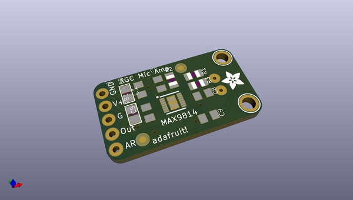

# OOMP Project  
## Adafruit-MAX9814-AGC-Microphone-PCB  by adafruit  
  
oomp key: oomp_projects_flat_adafruit_adafruit_max9814_agc_microphone_pcb  
(snippet of original readme)  
  
- Adafruit MAX9814 AGC Microphone PCB  
<a href="http://www.adafruit.com/products/1713">   
Click here to purchase one from the Adafruit shop</a>  
  
Add an ear to your project with this well-designed electret microphone amplifier with AGC. This fully assembled and tested board comes with a 20-20KHz electret microphone soldered on. For the amplification, we use the Maxim MAX9814, a specialty chip that is designed for amplifying electret microphones in situations where the loudness of the audio isn't predictable.  
  
The chip at the heart of this amp is the MAX9814, and has a few options you can configure with the breakout. The default 'max gain' is 60dB, but can be set to 40dB or 50dB by jumpering the Gain pin to VCC or ground. You can also change the Attack/Release ratio, from the default 1:4000 to 1:2000 or 1:500. The ouput from the amp is about 2Vpp max on a 1.25V DC bias, so it can be easily used with any Analog/Digital converter that is up to 3.3V input. If you want to pipe it into a Line Input, just use a 1-100uF blocking capacitor in series (100uF sounds best).  
  
PCB files for MAX9814 AGC Microphone. The format is EagleCAD schematic and board layout  
  
- https://www.adafruit.com/product/1713  
  
--- License  
  
Adafruit invests time and resources providing this open source design, please support Adafruit and open-source hardware by purchasing products from [Adafruit](https://www.adafruit.com)!  
  
All text above must be included in any   
  full source readme at [readme_src.md](readme_src.md)  
  
source repo at: [https://github.com/adafruit/Adafruit-MAX9814-AGC-Microphone-PCB](https://github.com/adafruit/Adafruit-MAX9814-AGC-Microphone-PCB)  
## Board  
  
  
## Schematic  
  
  
  
[schematic pdf](working_schematic.pdf)  
## Images  
  
  
  
  
  
  
  
  
  
  
  
  
  
  
  
  
