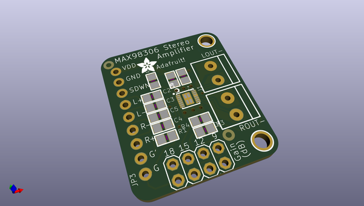
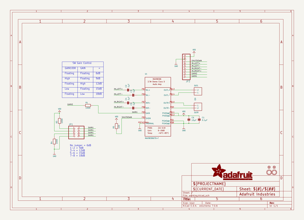
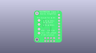
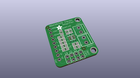
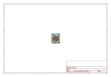
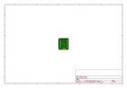
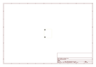
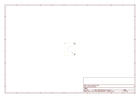
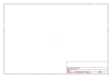
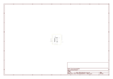

# OOMP Project  
## Adafruit-MAX98306-Class-D-Amp-PCB  by adafruit  
  
(snippet of original readme)  
  
-- Adafruit MAX98306 Class D Amp PCB  
  
<a href="http://www.adafruit.com/products/987">   
Click here to purchase one from the Adafruit shop  
</a>  
  
PCB files for the Adafruit MAX98306 Class D Amp. Format is EagleCAD schematic and board layout  
* https://www.adafruit.com/product/987  
  
This incredibly small stereo amplifier is surprisingly powerful - able to deliver 2 x 3.7W channels into 3 ohm impedance speakers. Inside the miniature chip is a class D controller, able to run from 2.7V-5.5VDC. Since the amp is a class D, its incredibly efficient (over 90% efficient when driving an 8Ω speaker at over a Watt) - making it perfect for portable and battery-powered projects. It has built in thermal and over-current protection but we could barely tell it got hot. This board is a welcome upgrade to basic "LM386" amps!  
  
The inputs of the amplifier go through 1.0uF capacitors, so they are fully 'differential' - if you don't have differential outputs, simply tie the R- and L- to ground. The outputs are "Bridge Tied" - that means they connect directly to the outputs, no connection to ground. The output is a 360KHz square wave PWM that is then 'averaged out' by the speaker coil - the high frequencies are not heard. All the above means that you can't connect the output into another amplifier, it should drive the speakers directly.  
  
Comes with a fully assembled and tested breakout board with 1.0uF input capacitors. We also include header to plug  
  full source readme at [readme_src.md](readme_src.md)  
  
source repo at: [https://github.com/adafruit/Adafruit-MAX98306-Class-D-Amp-PCB](https://github.com/adafruit/Adafruit-MAX98306-Class-D-Amp-PCB)  
## Board  
  
  
## Schematic  
  
  
  
[schematic pdf](working_schematic.pdf)  
## Images  
  
  
  
  
  
  
  
  
  
  
  
  
  
  
  
  
