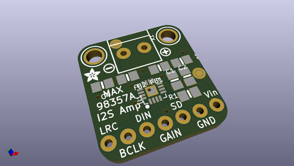
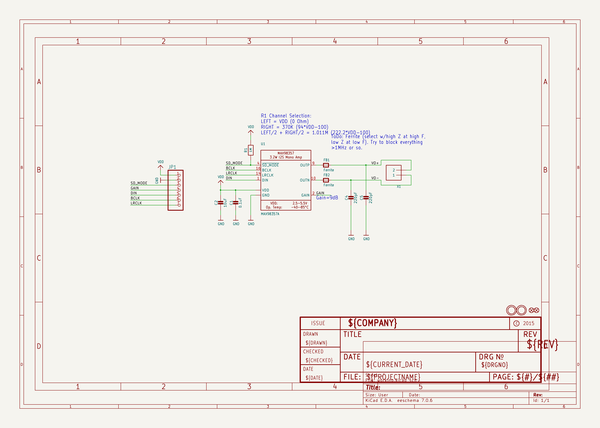
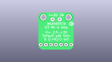
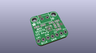
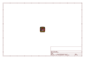
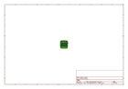
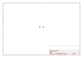
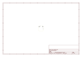
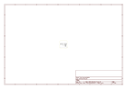

# OOMP Project  
## Adafruit-MAX98357-I2S-Amp-Breakout  by adafruit  
  
(snippet of original readme)  
  
-- Adafruit MAX98357 I2S Amp Breakout PCB  
<a href="http://www.adafruit.com/products/3006">   
Click here to purchase one from the Adafruit shop</a>  
  
The all in one digital audio amp breakout board that works incredibly well with the Raspberry Pi! If you're looking for an easy and low cost way to get you digital sound files bumpin' then the MAX98357 I2S Amp Breakout is for you. It takes standard I2S digital audio input and, not only decodes it into analog, but also amplifies it directly into a speaker. Perfect for adding compact amplified sound, it takes 2 breakouts (I2S DAC + Amp) and combines them into one.  
  
I2S (not to be confused with I2C) in a digital sound protocol that is used on circuit boards to pass audio data around. Many high end chips and processors manage all of the audio in digital I2S format. Then, to input or output data, three or four pins are used (data in, data out, bit clock and left-right channel select). Usually, for audio devices, there's a DAC chip that will take I2S in and convert it to analog that can drive a headphone.  
  
This small mono amplifier is surprisingly powerful - able to deliver 3.2 Watts of power into a 4 ohm impedance speaker (5V power @ 10% THD). Inside the miniature chip is a class D controller, able to run from 2.7V-5.5VDC. Since the amp is a class D, it's incredibly efficient - making it perfect for portable and battery-powered projects. It has built in thermal and over-current prot  
  full source readme at [readme_src.md](readme_src.md)  
  
source repo at: [https://github.com/adafruit/Adafruit-MAX98357-I2S-Amp-Breakout](https://github.com/adafruit/Adafruit-MAX98357-I2S-Amp-Breakout)  
## Board  
  
  
## Schematic  
  
  
  
[schematic pdf](working_schematic.pdf)  
## Images  
  
  
  
  
  
  
  
  
  
  
  
  
  
  
  
  
