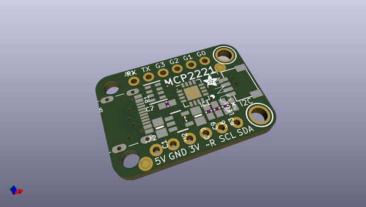
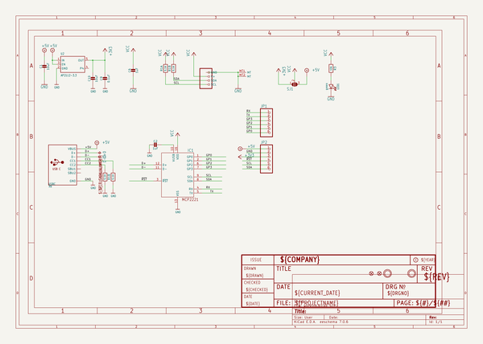
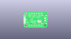
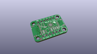
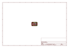
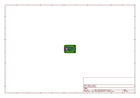
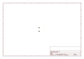
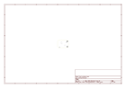
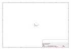

# OOMP Project  
## Adafruit-MCP2221-PCB  by adafruit  
  
oomp key: oomp_projects_flat_adafruit_adafruit_mcp2221_pcb  
(snippet of original readme)  
  
-- Adafruit MCP2221 PCB  
  
<a href="http://www.adafruit.com/products/4471">   
Click here to purchase one from the Adafruit shop</a>  
  
PCB files for the Adafruit MCP2221.   
  
Format is EagleCAD schematic and board layout  
* https://www.adafruit.com/product/4471  
  
--- Description  
  
The MCP2221 allows you to connect I2C sensors and breakouts to your PC running Windows, Linux, Mac OSX, or Linux. It also allows for general purpose digital inout and output (GPIO) for things like buttons and LEDs, analog to fdigital conversion (ADC), and digital to analog (DAC).  
  
--- License  
  
Adafruit invests time and resources providing this open source design, please support Adafruit and open-source hardware by purchasing products from [Adafruit](https://www.adafruit.com)!  
  
Designed by Limor Fried/Ladyada for Adafruit Industries.  
  
Creative Commons Attribution/Share-Alike, all text above must be included in any redistribution.   
See license.txt for additional details.  
  
  full source readme at [readme_src.md](readme_src.md)  
  
source repo at: [https://github.com/adafruit/Adafruit-MCP2221-PCB](https://github.com/adafruit/Adafruit-MCP2221-PCB)  
## Board  
  
  
## Schematic  
  
  
  
[schematic pdf](working_schematic.pdf)  
## Images  
  
  
  
  
  
  
  
  
  
  
  
  
  
  
  
  
