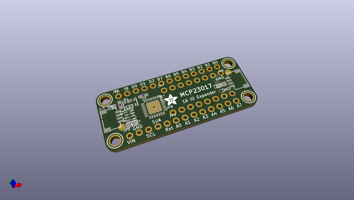
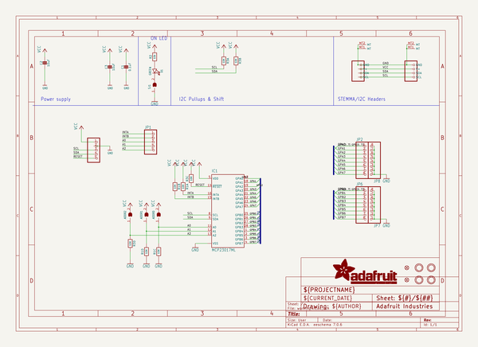
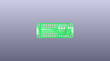
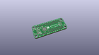
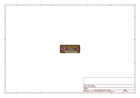
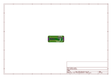
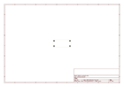
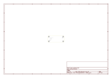
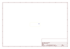
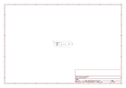

# OOMP Project  
## Adafruit-MCP23017-PCB  by adafruit  
  
oomp key: oomp_projects_flat_adafruit_adafruit_mcp23017_pcb  
(snippet of original readme)  
  
-- Adafruit MCP23017 I2C GPIO Expander Breakout - STEMMA QT / QWIIC PCB  
  
<a href="http://www.adafruit.com/products/5346">   
Click here to purchase one from the Adafruit shop</a>  
  
PCB files for the Adafruit MCP23017 I2C GPIO Expander Breakout - STEMMA QT / QWIIC.   
  
Format is EagleCAD schematic and board layout  
* https://www.adafruit.com/product/5346  
  
--- Description  
  
We’ve gotten a lot of requests for a MCP23017 breakout and we’ve always sorta been like “ehh why not just use the DIP chip?” but with STEMMA QT we could see the use case for a plug and play version that comes with all the passives on board. This Adafruit MCP23017 I2C GPIO Expander Breakout has 16 GPIO with matching ground pad.  
  
We particularly like the '17 as an expander for it's simple no-nonsense capability. It runs happily from 3V or 5V logic and power. Each GPIO can be an output driving up to 25mA, so LEDs are no problem. Or, each can be an input, with optional pullup. There are two IRQ pins that are configurable for what inputs to keep track of so no I2C bus polling is required. With 3 address pins, you can have up to 8 on a single bus for a total of 8 x 16 = 128 GPIO all on one I2C bus!  
  
We've got solid Arduino and CircuitPython libraries with examples, all ready for this chip. But even if you are using some other platform, the MCP23017 is so classic, you'll likely be able to find example code.  
  
Comes with two sticks of header so you can use it in a breadb  
  full source readme at [readme_src.md](readme_src.md)  
  
source repo at: [https://github.com/adafruit/Adafruit-MCP23017-PCB](https://github.com/adafruit/Adafruit-MCP23017-PCB)  
## Board  
  
  
## Schematic  
  
  
  
[schematic pdf](working_schematic.pdf)  
## Images  
  
  
  
  
  
  
  
  
  
  
  
  
  
  
  
  
