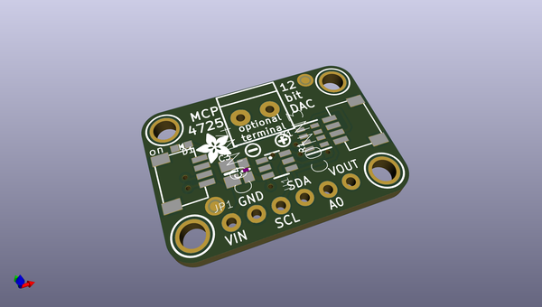
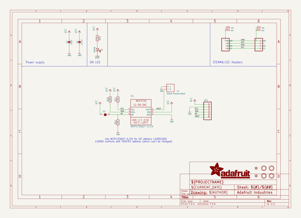
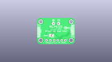
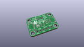
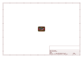
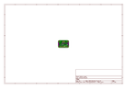
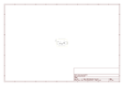

# OOMP Project  
## Adafruit-MCP4725-PCB  by adafruit  
  
(snippet of original readme)  
  
-- Adafruit MCP4725 12-Bit DAC Breakout PCB  
<a href="http://www.adafruit.com/products/935">   
Click here to purchase one from the Adafruit shop</a>  
  
This breakout board features the easy-to-use MCP4725 12-bit DAC. Control it via I2C and send it the value you want it to output, and the VOUT pin will have it. Great for audio / analog projects, such as when you can't use PWM but need a sine wave or adjustable bias point.  
  
We break out the ADDR/A0 pin so you can connect two of these DACs on one I2C bus, just tie that pin of one high to keep it from conflicting. Also included is a 6-pin header, for use in a breadboard. Works with both 3.3V or 5V logic.  
  
Some nice extras with this chip: for chips that have 3.4Mbps Fast Mode I2C (Arduino's don't) you can update the Vout at ~200 KHz. There's an EEPROM so if you write the output voltage, you can 'store it' so if the device is power cycled it will restore that voltage. The output voltage is rail-to-rail and proportional to the power pin so if you run it from 3.3V, the output range is 0-3.3V. If you run it from 5V the output range is 0-5V.  
  
These are the Eagle CAD files for the Adafruit MCP4725 12-Bit DAC Breakout:  
- https://www.adafruit.com/products/935  
  
--- License  
  
Adafruit invests time and resources providing this open source design, please support Adafruit and open-source hardware by purchasing products from [Adafruit](https://www.adafruit.com)!  
  
All text above must be included   
  full source readme at [readme_src.md](readme_src.md)  
  
source repo at: [https://github.com/adafruit/Adafruit-MCP4725-PCB](https://github.com/adafruit/Adafruit-MCP4725-PCB)  
## Board  
  
  
## Schematic  
  
  
  
[schematic pdf](working_schematic.pdf)  
## Images  
  
  
  
  
  
  
  
  
  
  
  
  
  
  
  
  
