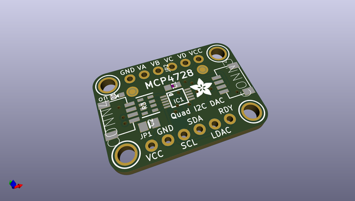
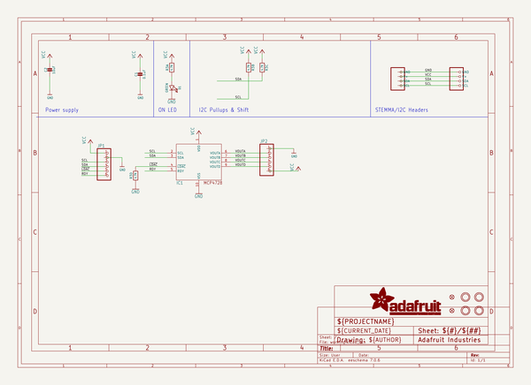
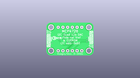
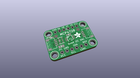
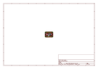
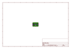
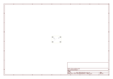
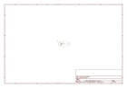

# OOMP Project  
## Adafruit-MCP4728-PCB  by adafruit  
  
(snippet of original readme)  
  
-- Adafruit MCP4728 Quad 12-bit I2C DAC PCB  
  
<a href="http://www.adafruit.com/products/4470">   
Click here to purchase one from the Adafruit shop</a>  
  
PCB files for the Adafruit MCP4728 Quad 12-bit I2C DAC.   
  
Format is EagleCAD schematic and board layout  
* https://www.adafruit.com/product/4470  
  
--- Description  
  
If you've ever said to yourself "Gee, I wish these four 12-bit DACs came in a single package with the ability to save their settings to an EEPROM", well I have good news. The MCP4728 is the answer to your wishes! Within it's little package, the MCP4728 has four, count em, four 12-bit DACs for whatever voltage setting needs you may have. In addition, it has the ability to store the settings for the DACs to an internal EEPROM so you can make like a Ronco Rotisserie and "set it and forget it". Once saved to the internal non-volatile memory, the settings will be loaded by default when the ADC powers up.  
  
To take things even further, the MCP4728 lets you chose between two sources for your reference voltage: the input voltage that you use to power it on the VCC pin, or an internal 2.048V reference voltage. If you use the internal reference voltage (Vref in DAC speak) you can choose between 1X and 2X gain for the output, allowing your voltages to range from 0V to 2.048 or 0V- 4.096V as your application requires.   
  
By default you'll use the input voltage as your Vref, allowing you to scale the voltages from 0V-3.3V or 5V dep  
  full source readme at [readme_src.md](readme_src.md)  
  
source repo at: [https://github.com/adafruit/Adafruit-MCP4728-PCB](https://github.com/adafruit/Adafruit-MCP4728-PCB)  
## Board  
  
  
## Schematic  
  
  
  
[schematic pdf](working_schematic.pdf)  
## Images  
  
  
  
  
  
  
  
  
  
  
  
  
  
  
  
  
