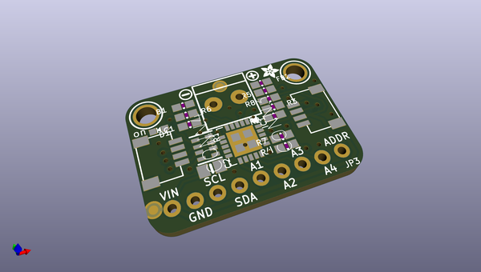

# OOMP Project  
## Adafruit-MCP9601-PCB  by adafruit  
  
oomp key: oomp_projects_flat_adafruit_adafruit_mcp9601_pcb  
(snippet of original readme)  
  
-- Adafruit MCP9601 (MCP96L01) I2C Thermocouple Amplifier - STEMMA QT / Qwiic PCB  
  
<a href="http://www.adafruit.com/products/5165">   
Click here to purchase one from the Adafruit shop</a>  
  
PCB files for the Adafruit MCP9601 (MCP96L01) I2C Thermocouple Amplifier - STEMMA QT / Qwiic.   
  
Format is EagleCAD schematic and board layout  
* https://www.adafruit.com/product/5165  
  
--- Description  
  
Thermocouples are very sensitive, requiring a good amplifier with a cold-compensation reference. The Adafruit MCP9601 I2C Thermocouple Breakout (a.k.a MCP96L01) does all that for you and can be easily interfaced with any microcontroller or single-board computer with I2C. Inside, the chip handles all the analog stuff for you, and can interface with just about any thermocouple type: K, J, T, N, S, E, B, and R types are all supported! You can also set various alerts for over/under temperature, and read the thermocouple (hot) temperature and the chip (cold) temperature. All this over common I2C.  
  
This breakout board has the chip itself, a 3.3V regulator and level shifting circuitry, all assembled and tested. Works great with 3.3V or 5V logic. Comes with a 2-pin terminal block (for connecting to the thermocouple) and pin header (to plug into any breadboard or perfboard). Match it up with our 1m K-type thermocouple.  
  
Works with any K, J, T, N, S, E, B, and R type thermocouple  
Datasheet rated for:  
K Type: -200°C to +1372°C  
J Type: -150°C to +1200°C  
  
  full source readme at [readme_src.md](readme_src.md)  
  
source repo at: [https://github.com/adafruit/Adafruit-MCP9601-PCB](https://github.com/adafruit/Adafruit-MCP9601-PCB)  
## Board  
  
  
## Schematic  
  
  
  
[schematic pdf](working_schematic.pdf)  
## Images  
  
  
  
  
  
  
  
  
  
  
  
  
  
  
  
  
