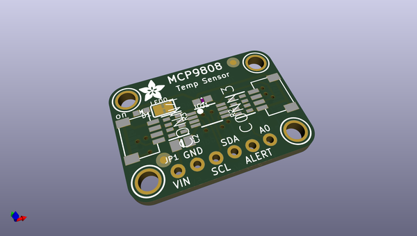
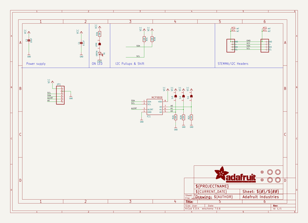
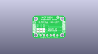
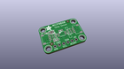
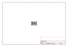
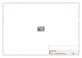
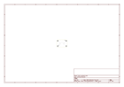
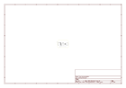

# OOMP Project  
## Adafruit-MCP9808-Breakout-PCB  by adafruit  
  
(snippet of original readme)  
  
-- Adafruit MCP9808 High Accuracy I2C Temperature Sensor Breakout PCB  
<a href="http://www.adafruit.com/products/5027">   
<a href="http://www.adafruit.com/products/1782">   
Click here to purchase one from the Adafruit shop</a>  
  
This I2C digital temperature sensor is one of the more accurate/precise we've ever seen, with a typical accuracy of ±0.25°C over the sensor's -40°C to +125°C range and precision of +0.0625°C. They work great with any microcontroller using standard i2c. There are 3 address pins so you can connect up to 8 to a single I2C bus without address collisions. Best of all, a wide voltage range makes it usable with 2.7V to 5.5V logic!  
  
Unlike the DS18B20, this sensor does not come in through-hole package so we placed this small sensor on a breakout board PCB for easy use. The PCB includes mounting holes, and pull down resistors for the 3 address pins. We even wrote a lovely little tutorial and library that will work with Arduino or CircuitPython. You'll be up and running in 15 minutes or less.  
  
PCB files for the Adafruit MCP9808 Breakout. The format is EagleCAD schematic and board layout  
- https://www.adafruit.com/products/1782  
  
--- License  
  
Adafruit invests time and resources providing this open source design, please support Adafruit and open-source hardware by purchasing products from [Adafruit](https://www.adafruit.com)!  
  
All text above must be included in  
  full source readme at [readme_src.md](readme_src.md)  
  
source repo at: [https://github.com/adafruit/Adafruit-MCP9808-Breakout-PCB](https://github.com/adafruit/Adafruit-MCP9808-Breakout-PCB)  
## Board  
  
  
## Schematic  
  
  
  
[schematic pdf](working_schematic.pdf)  
## Images  
  
  
  
  
  
  
  
  
  
  
  
  
  
  
  
  
