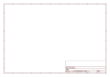
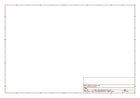

# OOMP Project  
## Adafruit-Menta-PCB  by adafruit  
  
oomp key: oomp_projects_flat_adafruit_adafruit_menta_pcb  
(snippet of original readme)  
  
- Adafruit MENTA  
  
These are the Eagle CAD files for the Adafruit MENTA  
  
  
  
Introducing the MENTA, a portable minty Arduino-compatible project that fits into a common mint tin. We took our super popular Boarduino series, and wrapped it with a prototyping area into a rounded PCB that slots directly into an Altoids-sized metal tin. We included everything you expect to jump-start your project:  
  
- DC power adapter jack with polarity protection  
- Beefy 1 Amp 5V regulator and 250mA 3.3V regulator for 3.3V devices  
- Green power LED, red blinky LED on pin 13  
- ISP-6 standard reprogramming header  
- FTDI interface plug to connect an [FTDI Friend](http://www.adafruit.com/products/284) or [FTDI Cable](https://www.adafruit.com/products/70)  
- Female header set so you can plug standard Arduino-compatible shields in.  
- There's four mounting holes if you want to attach it permanently to a box or plate  
- Massive prototyping area so you can have the finished project all fit together in a protective box.  
- Four rubber bumpers to protect your table from scratching, and the PCB and parts from the metal tin  
- [MENTA sticker (unaffixed)](http://www.adafruit.com/products/873)  
- __This pack even comes with the mint tin itself!__  
  
Comes as a kit of parts, this is an excellent beginner project, with [step-by-step instructions](http://ladyada.net/make/menta/index.html) even for someone who has never solder  
  full source readme at [readme_src.md](readme_src.md)  
  
source repo at: [https://github.com/adafruit/Adafruit-Menta-PCB](https://github.com/adafruit/Adafruit-Menta-PCB)  
## Board  
  
  
## Schematic  
  
  
  
[schematic pdf](working_schematic.pdf)  
## Images  
  
  
  
  
  
  
  
  
  
  
  
  
  
  
  
  
