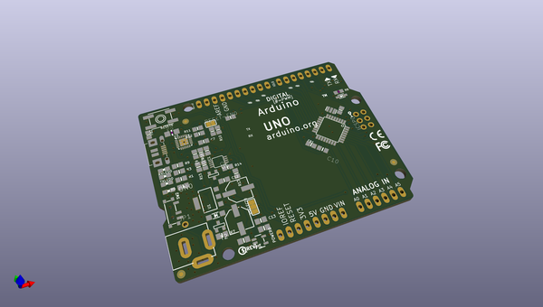
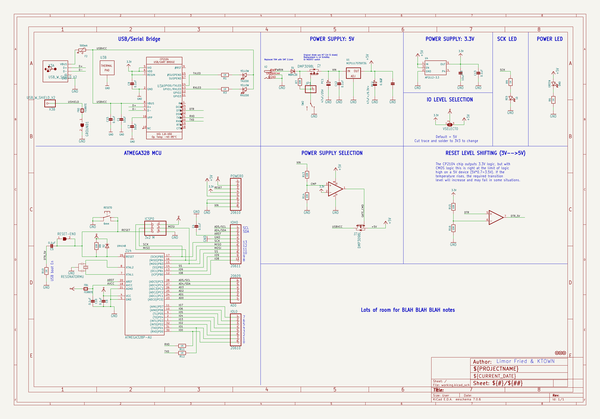
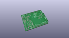
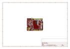
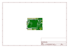
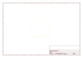
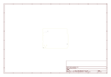
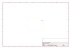
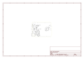

# OOMP Project  
## Adafruit-METRO-328-PCB  by adafruit  
  
(snippet of original readme)  
  
-- Adafruit METRO 328 PCB  
  
<a href="http://www.adafruit.com/products/2466">   
Click here to purchase one from the Adafruit shop</a>  
  
PCB files for the Adafruit METRO 328. Format is EagleCAD schematic and board layout  
  
For more details, check out the product page at  
* https://www.adafruit.com/products/2466  
  
--- Description  
  
We sure love the ATmega328 here at Adafruit, and we use them a lot for our own projects. The processor has plenty of GPIO, Analog inputs, hardware UART SPI and I2C, timers and PWM galore - just enough for most simple projects. When we need to go small, we use a Metro Mini, but when size isn't as much of a concern, and a USB-serial converter is required, we reach for an Adafruit METRO.  
  
METRO is the culmination of years of playing with AVRs: we wanted to make a development board that is easy to use and is hacker friendly.  
  
ATmega328 brains - This popular chip has 32KB of flash (1/2 K is reserved for the bootloader), 2KB of RAM, clocked at 16MHz  
Power the METRO with 7-9V polarity protected DC or the micro USB connector to any 5V USB source. The 2.1mm DC jack has an on/off switch next to it so you can turn off your setup easily. The METRO will automagically switch between USB and DC.  
METRO has 20 GPIO pins, 6 of which are Analog in as well, and 2 of which are reserved for the USB-serial converter. There's also 6 PWMs available on 3 timers (1 x 16-bit, 2 x 8-bit). There's a hardware SPI port, hardware I2C po  
  full source readme at [readme_src.md](readme_src.md)  
  
source repo at: [https://github.com/adafruit/Adafruit-METRO-328-PCB](https://github.com/adafruit/Adafruit-METRO-328-PCB)  
## Board  
  
  
## Schematic  
  
  
  
[schematic pdf](working_schematic.pdf)  
## Images  
  
  
  
  
  
  
  
  
  
  
  
  
  
  
  
  
