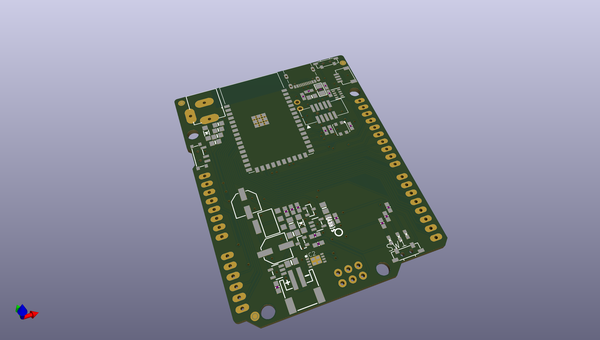
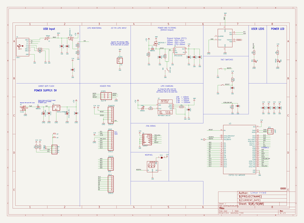
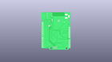
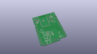
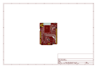
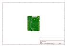
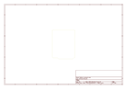
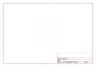
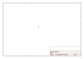
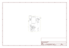

# OOMP Project  
## Adafruit-Metro-ESP32-S2-PCB  by adafruit  
  
oomp key: oomp_projects_flat_adafruit_adafruit_metro_esp32_s2_pcb  
(snippet of original readme)  
  
-- Adafruit Metro ESP32-S2 PCB  
  
<a href="http://www.adafruit.com/products/4775">   
Click here to purchase one from the Adafruit shop</a>  
  
PCB files for the Adafruit Metro ESP32-S2.  
  
Format is EagleCAD schematic and board layout  
* https://www.adafruit.com/product/4775  
  
--- Description  
  
What's Metro shaped and has an ESP32-S2 WiFi module? What has a STEMMA QT connector for I2C devices, and a Lipoly charger circuit? What's finishing up testing and nearly ready for fabrication? That's right - its the new Adafruit Metro ESP32-S2! With native USB and a load of PSRAM this board is perfect for use with CircuitPython or Arduino, to add low-cost WiFi while keeping shield-compatibility  
  
Features:  
  
* ESP32-S2 240MHz Tensilica processor - the next generation of ESP32, now with native USB so it can act like a keyboard/mouse, MIDI device, disk drive, etc!  
* WROVER module has FCC/CE certification and comes with 4 MByte of Flash and 8 MByte of PSRAM - you can have huge data buffers  
* Lotsa power options - 6-12VDC barrel jack or USB type C or Lipoly battery  
* Built-in battery charging when powered over DC or USB  
* UNO-shape so shields can plug in  
* Reset and DFU (BOOT0) buttons to get into the ROM bootloader (which is a USB serial port so you don't need a separate cable!)  
* Serial debug pins (optional, for checking the hardware serial debug console)  
* JTAG pads for advanced debugging access.  
* On/Off switch  
* STEMMA QT connector for I2C devi  
  full source readme at [readme_src.md](readme_src.md)  
  
source repo at: [https://github.com/adafruit/Adafruit-Metro-ESP32-S2-PCB](https://github.com/adafruit/Adafruit-Metro-ESP32-S2-PCB)  
## Board  
  
  
## Schematic  
  
  
  
[schematic pdf](working_schematic.pdf)  
## Images  
  
  
  
  
  
  
  
  
  
  
  
  
  
  
  
  
