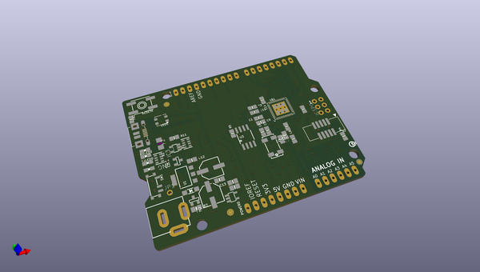
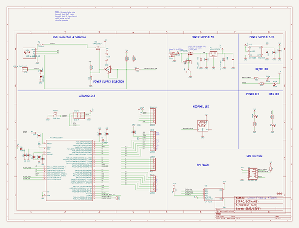
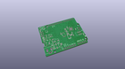
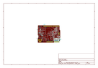
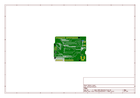
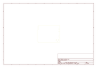
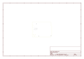
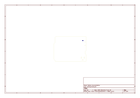
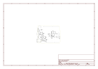

# OOMP Project  
## Adafruit-Metro-M0-Express-PCB  by adafruit  
  
oomp key: oomp_projects_flat_adafruit_adafruit_metro_m0_express_pcb  
(snippet of original readme)  
  
-- Adafruit METRO M0 Express - designed for CircuitPython - ATSAMD21G18 PCB  
  
<a href="http://www.adafruit.com/products/3505">   
Click here to purchase one from the Adafruit shop</a>  
  
PCB files for the Adafruit METRO M0 Express - designed for CircuitPython - ATSAMD21G18. Format is EagleCAD schematic and board layout  
* https://www.adafruit.com/product/3505  
  
--- Description  
  
Metro is our series of microcontroller boards for use with the Arduino IDE. This new **Metro M0 Express** board looks a whole lot like our [original Metro 328](https://www.adafruit.com/product/2488), but with a huge upgrade. Instead of the ATmega328, this Metro features a ATSAMD21G18 chip, an ARM Cortex M0+. It's our first Metro that is designed for use with CircuitPython! CircuitPython is our beginner-oriented flavor of MicroPython - and as the name hints at, its a small but full-featured version of the popular Python programming language specifically for use with circuitry and electronics.  
  
Not only can you use CircuitPython, but the Metro M0 is also usable in the Arduino IDE.  
  
At the Metro M0's heart is an ATSAMD21G18 ARM Cortex M0 processor, clocked at 48 MHz and at 3.3V logic, the same one used in the new [Arduino Zero](https://www.adafruit.com/products/2843). This chip has a whopping 256K of FLASH (8x more than the Atmega328) and 32K of RAM (16x as much)! This chip comes with built in USB so it has USB-to-Serial program & debug capability built in wi  
  full source readme at [readme_src.md](readme_src.md)  
  
source repo at: [https://github.com/adafruit/Adafruit-Metro-M0-Express-PCB](https://github.com/adafruit/Adafruit-Metro-M0-Express-PCB)  
## Board  
  
  
## Schematic  
  
  
  
[schematic pdf](working_schematic.pdf)  
## Images  
  
  
  
  
  
  
  
  
  
  
  
  
  
  
  
  
