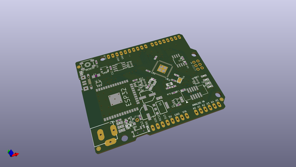
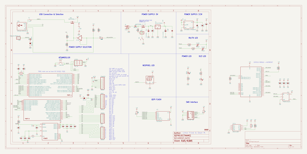
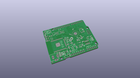
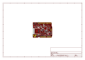
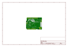
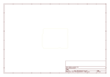
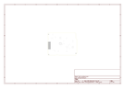
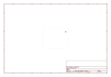
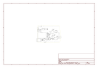

# OOMP Project  
## Adafruit-Metro-M4-Express-AirLift-PCB  by adafruit  
  
oomp key: oomp_projects_flat_adafruit_adafruit_metro_m4_express_airlift_pcb  
(snippet of original readme)  
  
-- Adafruit Metro M4 Express AirLift (WiFi) - Lite PCB  
  
<a href="http://www.adafruit.com/products/4000">   
Click here to purchase one from the Adafruit shop</a>  
  
PCB files for the Adafruit Metro M4 Express AirLift (WiFi) - Lite.   
  
Format is EagleCAD schematic and board layout  
* https://www.adafruit.com/product/4000  
  
--- Description  
  
Give your next project a lift with _AirLift_ - our witty name for the ESP32 co-processor that graces this Metro M4. You already know about the **Adafruit Metro M4** featuring the **Microchip ATSAMD51**, with it's 120MHz Cortex M4 with floating point support. With a train-load of FLASH and RAM, your code will be fast and roomy. And what better way to improve it than to add wireless? Now cooked in directly on board, you get a certified WiFi module that can handle all your TLS and socket needs, it even has root certificates pre-loaded.  
  
This Metro is the same size as the others, and is compatible with all our shields. It's got analog pins where you expect, and SPI/UART/I2C hardware support in the same spot as the Metro 328 and M0. But! It's powered with an ATSAMD51J19:  
 * Cortex M4 core running at **120 MHz**  
 * [Floating point support with Cortex M4 DSP instructions](https://developer.arm.com/technologies/dsp/dsp-for-cortex-m)  
 * **512 KB** flash, **192 KB** RAM  
 * 32-bit, 3.3V logic and power  
 * Dual 1 MSPS DAC (A0 and A1)  
 * Dual 1 MSPS ADC (8 analog pins)  
 * 6 x hardware SERCOM (I2C, SPI or UAR  
  full source readme at [readme_src.md](readme_src.md)  
  
source repo at: [https://github.com/adafruit/Adafruit-Metro-M4-Express-AirLift-PCB](https://github.com/adafruit/Adafruit-Metro-M4-Express-AirLift-PCB)  
## Board  
  
  
## Schematic  
  
  
  
[schematic pdf](working_schematic.pdf)  
## Images  
  
  
  
  
  
  
  
  
  
  
  
  
  
  
  
  
