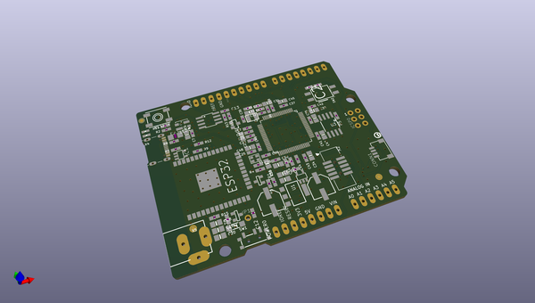
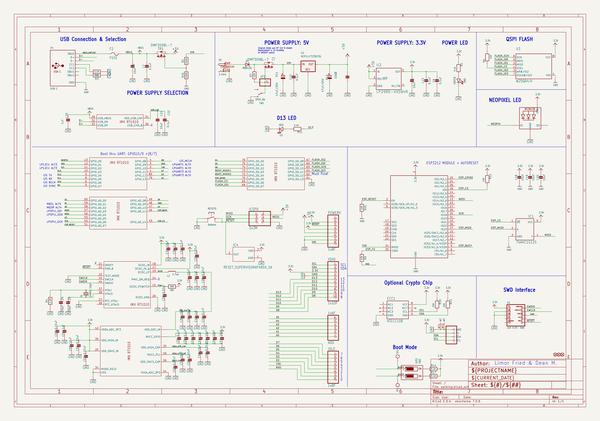
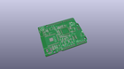
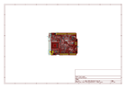
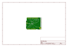
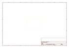
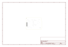
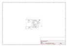

# OOMP Project  
## Adafruit-Metro-M7-with-AirLift-PCB  by adafruit  
  
oomp key: oomp_projects_flat_adafruit_adafruit_metro_m7_with_airlift_pcb  
(snippet of original readme)  
  
-- Adafruit Metro M7 with AirLift - Featuring NXP iMX RT1011 PCB  
  
<a href="http://www.adafruit.com/products/4950">   
Click here to purchase one from the Adafruit shop</a>  
  
PCB files for the Adafruit Metro M7 with AirLift - Featuring NXP iMX RT1011.   
  
Format is EagleCAD schematic and board layout  
* https://www.adafruit.com/product/4950  
  
--- Description  
  
Get ready for our fastest Metro ever - the NXP iMX RT1011 microcontroller powers this board with a 500 MHz ARM Cortex M7 processor. There's 4 MB of execute-in-place QSPI for firmware + disk storage and 128KB of SRAM in-chip.  
  
Features:  
  
* NXP iMX RT1011 processor - ARM Cortex M7 processor running at 500 MHz, with 128KB SRAM and high speed USB!  
* AirLift WiFi Co-processor, with TLS/SSL support, plenty of RAM for sockets, communication is over SPI and has CircuitPython library support ready to go for fast wireless integration.  
* 4MB of QSPI XIP Flash  
* Power options - 6-12VDC barrel jack or USB type C  
* UNO-shape so shields can plug in  
* Reset  button - Click to restart, double-click to enter UF2 bootloder  
* Boot-mode switches to get into the ROM bootloader (you can always reload code over USB if TinyUF2 gets corrupted somehow)  
* SWD connector for advanced debugging access.  
* On/Off switch  
* STEMMA QT connector for I2C devices  
* On/User LEDs + status NeoPixel  
* Works with CircuitPython!  
* 53.2mm x 72mm / 2" x 2.8"  
* Height (w/ barrel jack): 14.8mm / 0.6"  
* Weight: 22.5g  
  
---  
  full source readme at [readme_src.md](readme_src.md)  
  
source repo at: [https://github.com/adafruit/Adafruit-Metro-M7-with-AirLift-PCB](https://github.com/adafruit/Adafruit-Metro-M7-with-AirLift-PCB)  
## Board  
  
  
## Schematic  
  
  
  
[schematic pdf](working_schematic.pdf)  
## Images  
  
  
  
  
  
  
  
  
  
  
  
  
  
  
  
  
