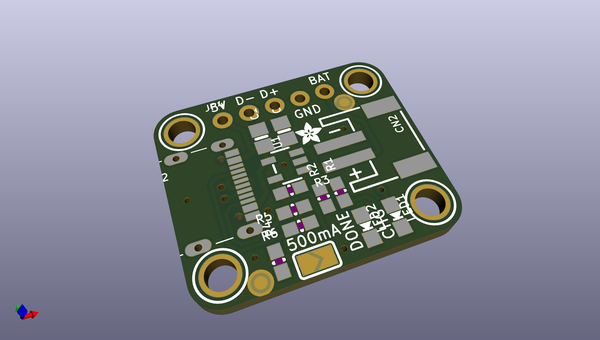
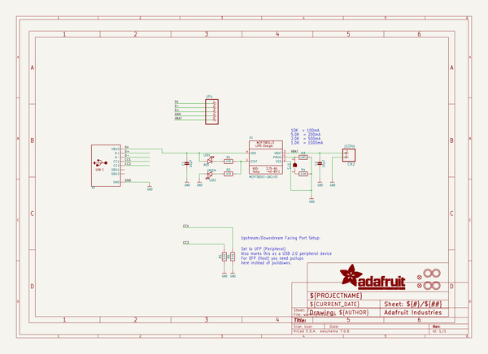
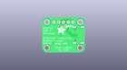
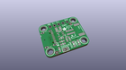
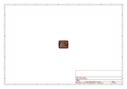
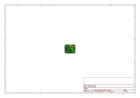
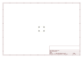
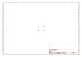
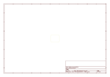

# OOMP Project  
## Adafruit-MicroLipo-PCB  by adafruit  
  
(snippet of original readme)  
  
- Adafruit MicroLipo and MiniLipo Charging Boards/Backpacks  
  
&nbsp;   
   
&nbsp;   
   
&nbsp;   
   
  
Click to purchase from the Adafruit Shop:  
- [Adafruit Micro-Lipo Charger for LiPo/LiIon Batt w/MicroUSB Jack - v1](https://www.adafruit.com/product/1904)  
- [Adafruit Micro Lipo - USB LiIon/LiPoly charger - v1](https://www.adafruit.com/product/1304)  
- [Adafruit Mini Lipo w/Mini-B USB Jack - USB LiIon/LiPoly charger - v1](https://www.adafruit.com/product/1905)  
- [Adafruit LiIon/LiPoly Backpack Add-On for Pro Trinket/ItsyBitsy](https://www.adafruit.com/product/2124)  
- [Adafruit Micro-Lipo Charger for LiPoly Batt with USB Type C Jack](https://www.adafruit.com/product/4410)  
- [Adafruit Micro Lipo - USB LiIon/LiPoly charger - v2](https://www.adafruit.com/product/1304)  
  
Oh so handy, this little lipo charger is so small and easy to use you can keep it on your desk or mount it  
  full source readme at [readme_src.md](readme_src.md)  
  
source repo at: [https://github.com/adafruit/Adafruit-MicroLipo-PCB](https://github.com/adafruit/Adafruit-MicroLipo-PCB)  
## Board  
  
  
## Schematic  
  
  
  
[schematic pdf](working_schematic.pdf)  
## Images  
  
  
  
  
  
  
  
  
  
  
  
  
  
  
  
  
