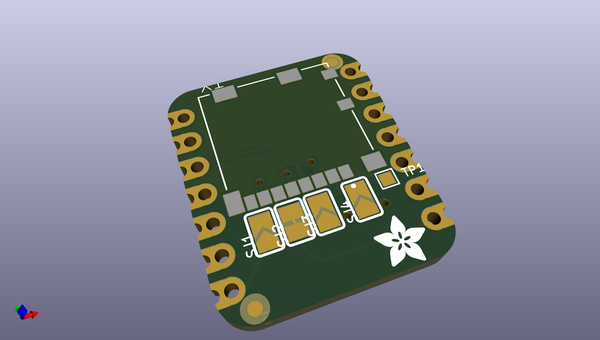
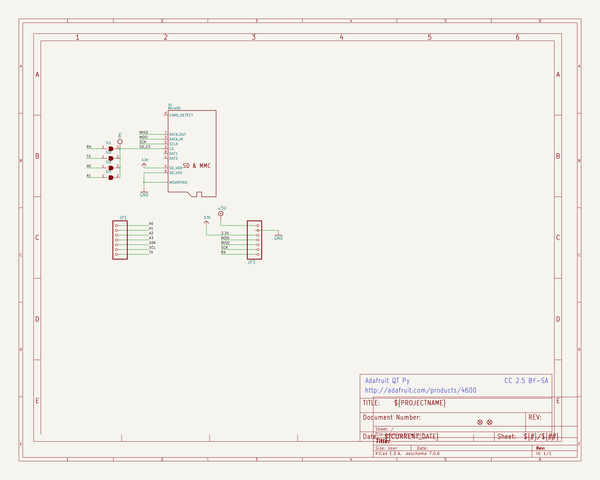
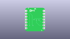
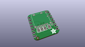
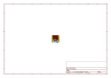
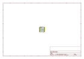
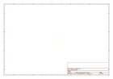
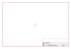

# OOMP Project  
## Adafruit-microSD-Card-BFF-PCB  by adafruit  
  
(snippet of original readme)  
  
-- Adafruit microSD Card BFF Add-On for QT Py and Xiao PCB  
  
<a href="http://www.adafruit.com/products/5683">   
Click here to purchase one from the Adafruit shop</a>  
  
PCB files for the Adafruit microSD Card BFF Add-On for QT Py and Xiao.   
  
Format is EagleCAD schematic and board layout  
* https://www.adafruit.com/product/5683  
  
--- Description  
  
Our QT Py boards are a great way to make very small microcontroller projects that pack a ton of power - and now we have a way for you to add a ton of storage, for reading and writing, with a micro SD card slot that can fit on the back of your miniature dev board. It uses the three SPI pins plus one chip select pin to access megs or gigs of data.  
  
We call this the Adafruit microSD BFF - a "Best Friend Forever". When you were a kid you may have learned about the "buddy" system, well this product is kinda like that! A board that will watch your QT Py's back and give it more capabilities.  
  
This PCB is designed to fit onto the back of any QT Py or Xiao board, it can be soldered into place or use pin and socket headers to make it removable. Onboard is a slim, high quality Molex push-pull micro SD card socket. Since the QT Py is already 3V, no level shifter or regulator is required. We're using SPI mode to interface, use the MOSI/MISO/SCK pins plus one other chip select pin. The default is TX but there are some solder jumpers you can use to select RX, A0 or A1.  
  
We include some header that you   
  full source readme at [readme_src.md](readme_src.md)  
  
source repo at: [https://github.com/adafruit/Adafruit-microSD-Card-BFF-PCB](https://github.com/adafruit/Adafruit-microSD-Card-BFF-PCB)  
## Board  
  
  
## Schematic  
  
  
  
[schematic pdf](working_schematic.pdf)  
## Images  
  
  
  
  
  
  
  
  
  
  
  
  
  
  
  
  
