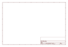

# OOMP Project  
## Adafruit_Microtouch  by adafruit  
  
oomp key: oomp_projects_flat_adafruit_adafruit_microtouch  
(snippet of original readme)  
  
- Microtouch - AVR development board with 2.8" TFT Touch Screen  
  
  
  
[We've not made the Microtouch for many years - check out the PyPortal for a similar device that also includes WiFi and a Cortex M4 processor!](https://www.adafruit.com/product/4116)  
  
Sure, the latest "iTouchy" gadgets are pretty cool. But who wants a locked down device? __Why not build your own touch-screen device__, with your own apps, all on open source hardware and using open source tools? OK, it can't play MP3s, but it does have a 320x240 TFT color display with resistive touch screen, an Atmega32u4 8-bit microcontroller, lithium polymer battery charger, backlight control, micro-SD slot, and a triple-axis accelerometer. Yeah, this is the next big thing and for those of us who like to DIY, you can do a lot of cool stuff with this dev board.  
  
This product is just the Microtouch dev board (preloaded with some demo Apps), and does not include a lithium polymer battery or a microSD card. You will need a lipoly battery with 2-pin JST connector for best performance. It can run straight from USB but due to the charger design, the backlight will be dimmed so it will not appear as bright as with a battery installed. [We strongly suggest our medium lipoly](https://www.adafruit.com/product/258) but you can substitute another 3.7V cell. [A microSD](https://www.adafruit.com/product/102) card will be handy if you want to  
  full source readme at [readme_src.md](readme_src.md)  
  
source repo at: [https://github.com/adafruit/Adafruit_Microtouch](https://github.com/adafruit/Adafruit_Microtouch)  
## Board  
  
  
## Schematic  
  
  
  
[schematic pdf](working_schematic.pdf)  
## Images  
  
  
  
  
  
  
  
  
  
  
  
  
  
  
  
  
