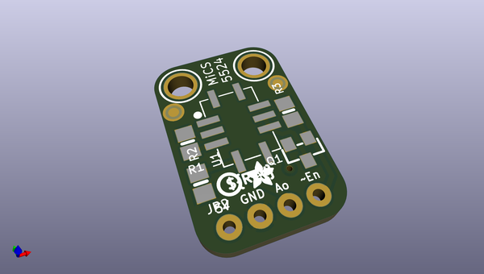
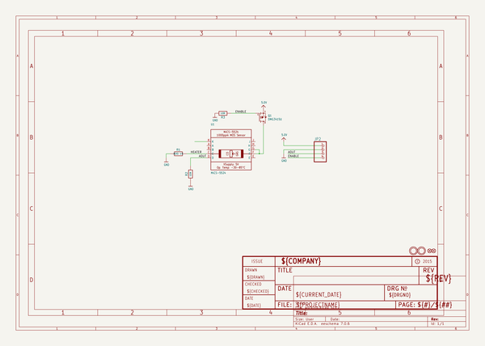
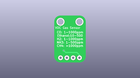
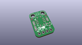
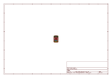
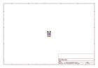
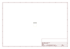
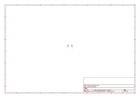
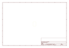
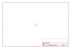

# OOMP Project  
## Adafruit-MiCS-5524-Gas-Sensor-Breakout-PCB  by adafruit  
  
oomp key: oomp_projects_flat_adafruit_adafruit_mics_5524_gas_sensor_breakout_pcb  
(snippet of original readme)  
  
-- Adafruit MiCS 5524 Gas Sensor Breakout PCB  
<a href="http://www.adafruit.com/products/3199">   
Click here to purchase one from the Adafruit shop</a>  
  
Give your next sensor project a nose for gasses with the Adafruit MiCS-5524 Gas Sensor Breakout. This breakout makes it easy to use this nice sensor from SGX Sensortech. The MiCS-5524 is a robust MEMS sensor for indoor carbon monoxide and natural gas leakage detection, it's suitable also for indoor air quality monitoring; breath checker and early fire detection.  
  
Please note: This sensor is sensitive to CO ( ~ 1 to 1000 ppm), Ammonia (~ 1 to 500 ppm), Ethanol (~ 10 to 500 ppm), H2 (~ 1 - 1000 ppm), and Methane / Propane / Iso-Butane (~ 1,000++ ppm). However, it can't tell you which gas it has detected.   
  
PCB files for the Adafruit MiCS-5524 Gas Sensor Breakout. The format is EagleCAD schematic and board layout  
- https://www.adafruit.com/product/3199  
  
--- License  
  
Adafruit invests time and resources providing this open source design, please support Adafruit and open-source hardware by purchasing products from [Adafruit](https://www.adafruit.com)!  
  
All text above must be included in any redistribution  
  
Designed by Limor Fried/Ladyada for Adafruit Industries.  
Creative Commons Attribution/Share-Alike, all text above must be included in any redistribution.   
See license.txt for additional information.  
  
  full source readme at [readme_src.md](readme_src.md)  
  
source repo at: [https://github.com/adafruit/Adafruit-MiCS-5524-Gas-Sensor-Breakout-PCB](https://github.com/adafruit/Adafruit-MiCS-5524-Gas-Sensor-Breakout-PCB)  
## Board  
  
  
## Schematic  
  
  
  
[schematic pdf](working_schematic.pdf)  
## Images  
  
  
  
  
  
  
  
  
  
  
  
  
  
  
  
  
