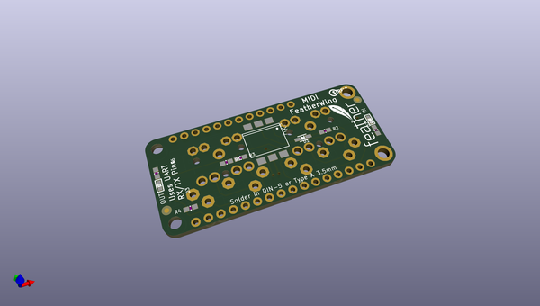
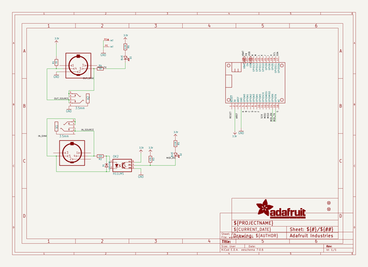
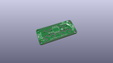
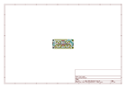
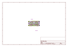
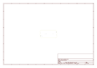
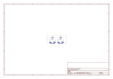
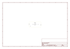

# OOMP Project  
## Adafruit-MIDI-FeatherWing-PCB  by adafruit  
  
oomp key: oomp_projects_flat_adafruit_adafruit_midi_featherwing_pcb  
(snippet of original readme)  
  
-- Adafruit MIDI FeatherWing Kit PCB  
  
<a href="http://www.adafruit.com/products/4740">   
Click here to purchase one from the Adafruit shop</a>  
  
PCB files for the Adafruit MIDI FeatherWing Kit.  
  
Format is EagleCAD schematic and board layout  
* https://www.adafruit.com/product/4740  
  
--- Description  
  
Turn your Feather into a song-bird with this musically-enabled FeatherWing that adds MIDI input and output jacks to just about any Feather. You get both input and output DIN-5 MIDI jacks, a 3V optically isolator so you can interface with MIDI on 3.3V logic/power microcontrollers, and two blinky indicator LEDs underneath the jacks to help you know when data is sent and received.  
  
For those who have moved from DIN-5 jacks to "TRS MIDI A" 3.5mm jacks, we provide spots to solder in 3.5mm stereo jacks (optional and not included by default)  
  
We use the hardware serial pins RX and TX to send/receive data - you'll need to set these to 31250 baud in your programming language and then send/receive MIDI packet data. For example, here's how you would do it in Arduino or a full-featured library with helpers. Here's an example on using a UART for MIDI transport in CircuitPython.  
  
Because we use the UART, this works with all Feathers except for those with USB-Serial converters that use the UART pins. Right now that means the ESP8266 Huzzah Feather, 328p Feather and nRF52 Feather don't work because they use the hardware UART for programming. Any o  
  full source readme at [readme_src.md](readme_src.md)  
  
source repo at: [https://github.com/adafruit/Adafruit-MIDI-FeatherWing-PCB](https://github.com/adafruit/Adafruit-MIDI-FeatherWing-PCB)  
## Board  
  
  
## Schematic  
  
  
  
[schematic pdf](working_schematic.pdf)  
## Images  
  
  
  
  
  
  
  
  
  
  
  
  
  
  
  
  
