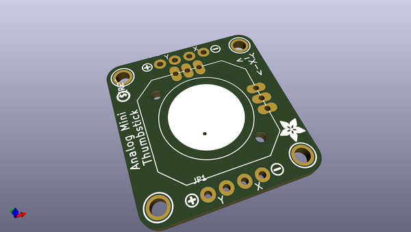
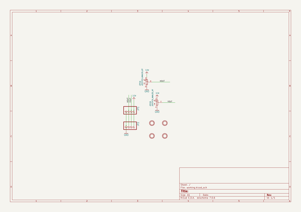
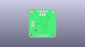
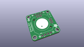
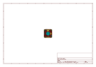
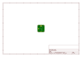
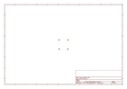
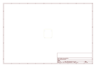
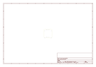

# OOMP Project  
## Adafruit-Mini-Analog-Thumbstick-Breakout-PCB  by adafruit  
  
(snippet of original readme)  
  
-- Adafruit Mini Analog Thumbstick Breakout PCB  
<a href="http://www.adafruit.com/products/3246">   
Click here to purchase one from the Adafruit shop</a>  
  
Are you itching for an easy way to mount a PSP-like thumb joystick to your project? This Analog Mini Thumbstick Breakout Board will help you do just that!  
  
This is a neat little PCB, on which you can mount a joystick/thumbstick -- we recommend this one. Since it's analog, you'll need two analog reading pins on your microcontroller to determine X and Y.  
  
We designed the breakout so that you can attach the thumbstick to a panel easily. A 4-pin 0.1" spaced header makes it easy to connect either in a perfboard/breadboard setting or free wiring, with header on both siders it is mechanically stable. You'll need to solder a thumbstick into the PCB using a soldering iron and solder, but its very simple and will only take a minute.  
  
Includes 1 x 8-pin 0.1 inch male header. Note: Thumbstick itself is not included.  
  
PCB files for the Adafruit Mini Analog Thumbstick Breakout. The format is EagleCAD schematic and board layout  
- http://www.adafruit.com/products/3246  
  
--- License  
  
Adafruit invests time and resources providing this open source design, please support Adafruit and open-source hardware by purchasing products from [Adafruit](https://www.adafruit.com)!  
  
All text above must be included in any redistribution  
  
Designed by Limor Fried/Ladyada for Adafruit Industries.  
Creative Com  
  full source readme at [readme_src.md](readme_src.md)  
  
source repo at: [https://github.com/adafruit/Adafruit-Mini-Analog-Thumbstick-Breakout-PCB](https://github.com/adafruit/Adafruit-Mini-Analog-Thumbstick-Breakout-PCB)  
## Board  
  
  
## Schematic  
  
  
  
[schematic pdf](working_schematic.pdf)  
## Images  
  
  
  
  
  
  
  
  
  
  
  
  
  
  
  
  
