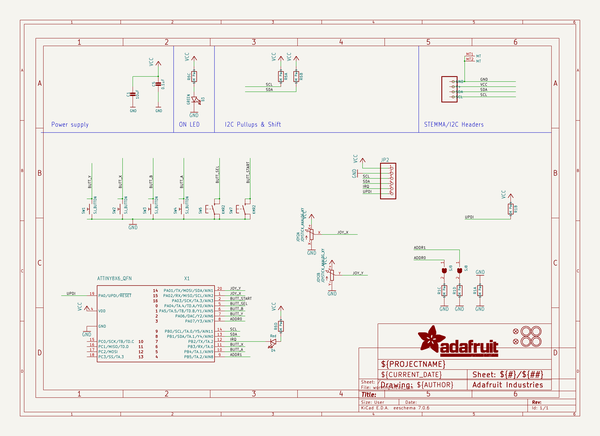

# OOMP Project  
## Adafruit-Mini-I2C-Gamepad-PCB  by adafruit  
  
(snippet of original readme)  
  
-- Adafruit Mini I2C Gamepad with seesaw and STEMMA QT PCB  
  
<a href="http://www.adafruit.com/products/5743">   
Click here to purchase one from the Adafruit shop</a>  
  
PCB files for the Adafruit Mini I2C Gamepad with seesaw and STEMMA QT.   
  
Format is EagleCAD schematic and board layout  
* https://www.adafruit.com/product/5743  
  
--- Description  
  
Make a game or robotic controller for any I2C microcontroller or microcomputer with this tiny gamepad breakout board. This design has a 2-axis thumb joystick and 6 momentary buttons (4 large and 2 small). The board communicates with your host microcontroller over I2C so it's easy to use and doesn't take up any of your precious analog or digital pins. There is also an optional interrupt pin that can alert your feather when a button has been pressed or released to free up processor time for other tasks.  
  
You can use our Arduino library to control and read data with any compatible microcontroller. We also have CircuitPython/Python code for use with computers or single-board Linux boards.  
  
To get you going fast, this board comes with a STEMMA QT connector, making them easy to interface with. The STEMMA QT connector is compatible with the SparkFun Qwiic I2C connectors. This allows you to make solderless connections between your development board and the gamepad or to chain it with a wide range of other sensors and accessories using a compatible cable and a 'hub' board. QT Cable is not include  
  full source readme at [readme_src.md](readme_src.md)  
  
source repo at: [https://github.com/adafruit/Adafruit-Mini-I2C-Gamepad-PCB](https://github.com/adafruit/Adafruit-Mini-I2C-Gamepad-PCB)  
## Board  
  
  
## Schematic  
  
  
  
[schematic pdf](working_schematic.pdf)  
## Images  
  
  
  
  
  
  
  
  
  
  
  
  
  
  
  
  
