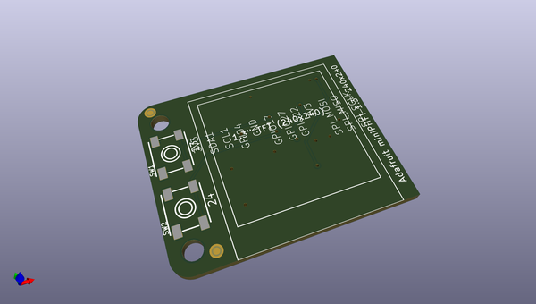
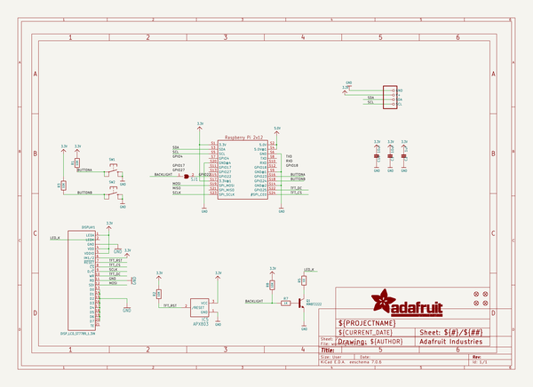
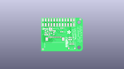
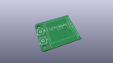
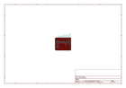
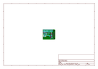
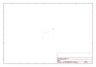
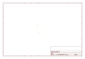
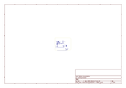
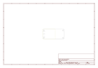

# OOMP Project  
## Adafruit-Mini-PiTFT-240x135-TFT-PCB  by adafruit  
  
(snippet of original readme)  
  
-- Adafruit Mini PiTFT - 135x240 and 240x240 Color TFT Add-ons for Raspberry Pi PCB  
  
<a href="http://www.adafruit.com/products/4393">   
<a href="http://www.adafruit.com/products/4484">   
Click here to purchase one from the Adafruit shop</a>  
  
PCB files for the Adafruit Mini PiTFT - 135x240 and 240x240 Color TFT Add-ons for Raspberry Pi.   
  
Format is EagleCAD schematic and board layout  
* https://www.adafruit.com/product/4393  
* https://www.adafruit.com/product/4484  
  
--- Description  
  
If you're looking for the most compact li'l color display for a [Raspberry Pi](https://www.adafruit.com/category/361) (most likely a [Pi Zero](https://www.adafruit.com/category/813)) project, this might be just the thing you need!  
  
The **Adafruit Mini PiTFT - 135x240 Color TFT Add-on for Raspberry Pi** and the **Adafruit Mini PiTFT - 1.3" 240x240 Color TFT Add-on for Raspberry Pi** are your little TFT pals, ready to snap onto any and all Raspberry Pi computers, to give you a little display. The Mini PiTFT comes with a full color 240x135 or 240x240 pixel IPS display with great visibility at all angles. The TFT uses only the SPI port so its very fast, and we leave plenty of pins remaining available for buttons, LEDs, sensors, etc. It's also nice and compact so it will fit into any case.  
  
This display is super small, only about 1.14" diagonal or 1.3" diagonal, but since it is an IPS display, its very  
  full source readme at [readme_src.md](readme_src.md)  
  
source repo at: [https://github.com/adafruit/Adafruit-Mini-PiTFT-240x135-TFT-PCB](https://github.com/adafruit/Adafruit-Mini-PiTFT-240x135-TFT-PCB)  
## Board  
  
  
## Schematic  
  
  
  
[schematic pdf](working_schematic.pdf)  
## Images  
  
  
  
  
  
  
  
  
  
  
  
  
  
  
  
  
