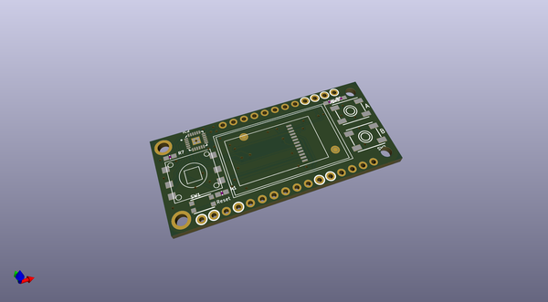
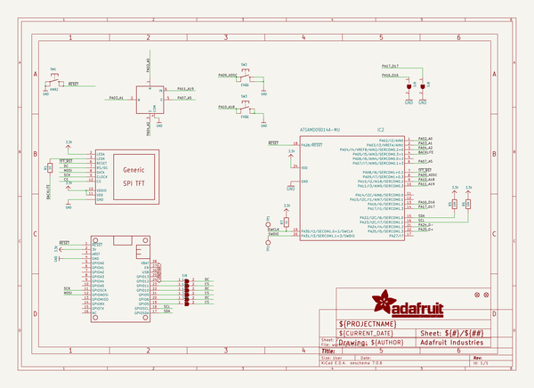
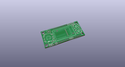
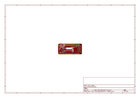
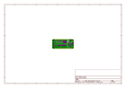
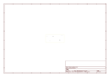
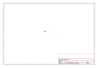
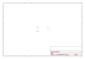

# OOMP Project  
## Adafruit-Mini-TFT-with-Joystick-Featherwing-PCB  by adafruit  
  
oomp key: oomp_projects_flat_adafruit_adafruit_mini_tft_with_joystick_featherwing_pcb  
(snippet of original readme)  
  
-- Adafruit Mini Color TFT with Joystick FeatherWing PCB  
  
<a href="http://www.adafruit.com/products/3321">   
Click here to purchase one from the Adafruit shop</a>  
  
PCB files for the Adafruit Mini Color TFT with Joystick FeatherWing. Format is EagleCAD schematic and board layout  
* https://www.adafruit.com/product/3321  
  
--- Description  
  
Add a dazzling color display to your Feather project with this **Adafruit Mini Color TFT with Joystick FeatherWing**.  
  
It has so much stuff going on, we could not fit any more parts on the PCB! There's a **0.96" 160x80 Color TFT Display** with 16-bit full color capability. And, so you can make a proper UI we added a 5-way navigation switch and two push buttons. The joystick can go left, right, up, down and 'in' for selection. Two buttons on the side can change modes or whatever you like.  
  
Thanks to **seesaw** the 7 user interface switches are managed over I2C so you don't need any extra GPIO pins to spare, this display will even work on low-pin-availability Feathers like the ESP8266. All you need is the standard hardware SPI, I2C and two GPIO for TFT control. Heck, even the TFT reset pin and backlight is controlled by seesaw, all over I2C!  
  
This lovely little display breakout is a great way to add a small, colorful and bright display to any Feather project, and it works with all of our Feathers. Since the display uses 4-wire SPI to communicate and has its own pixel-addressable frame buffer, it  
  full source readme at [readme_src.md](readme_src.md)  
  
source repo at: [https://github.com/adafruit/Adafruit-Mini-TFT-with-Joystick-Featherwing-PCB](https://github.com/adafruit/Adafruit-Mini-TFT-with-Joystick-Featherwing-PCB)  
## Board  
  
  
## Schematic  
  
  
  
[schematic pdf](working_schematic.pdf)  
## Images  
  
  
  
  
  
  
  
  
  
  
  
  
  
  
  
  
