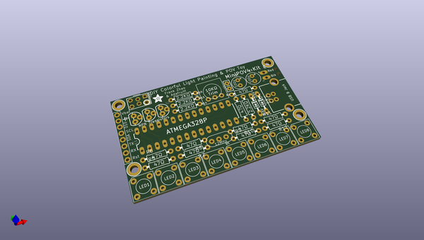
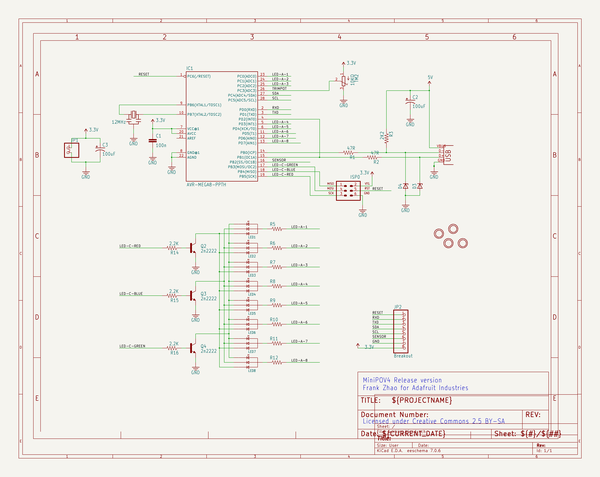
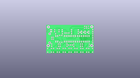
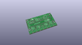
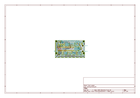
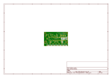
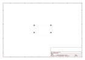
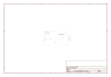

# OOMP Project  
## Adafruit-MiniPOV4-Kit  by adafruit  
  
oomp key: oomp_projects_flat_adafruit_adafruit_minipov4_kit  
(snippet of original readme)  
  
MiniPOV4-Kit  
============  
  
Files, Firmware and Software for the MiniPOV4 color light-painting kit  
Pick up a kit here: https://www.adafruit.com/products/1776  
  
The latest and greatest MiniPOV kit to hit the streets - MiniPOV4! We have added full color RGB LEDs to the kit as well USB programmability to make this the easiest, most fun Persistence-of-Vision & Light Painting kit ever.  
  
Learn to solder by building this easy kit. About 30 components are soldered onto the custom PCB using a soldering iron, solder and some basic hand tools such as diagonal cutters and wire strippers. Learn as you go, starting with the easier parts and working your way up to the more challenging ones. Takes about an hour or two to complete following our detailed tutorial, depending on your previous soldering experience.   
  
* Firmware: The Arduino-IDE compatible firmware that draws images from EEPROM  
  
* Hardware: PCB files in Eagle CAD format  
  
* Images: some test pix we use  
  
* Bootloader: The V-USB based bootloader that lets you program the EEPROM over USB for uploading new images.  
  
* Software: The image uploader, for use with Processing!  
  full source readme at [readme_src.md](readme_src.md)  
  
source repo at: [https://github.com/adafruit/Adafruit-MiniPOV4-Kit](https://github.com/adafruit/Adafruit-MiniPOV4-Kit)  
## Board  
  
  
## Schematic  
  
  
  
[schematic pdf](working_schematic.pdf)  
## Images  
  
  
  
  
  
  
  
  
  
  
  
  
  
  
  
  
