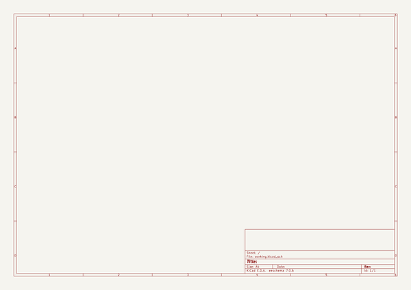

# OOMP Project  
## Adafruit_MintyBoost_PCB  by adafruit  
  
(snippet of original readme)  
  
- MintyBoost Kit  
  
<a href="http://www.adafruit.com/products/14"> Click here to purchase one from the Adafruit shop</a>  
  
The world's first and only open-source hardware charger: The MintyBoost®!  
  
__New version!__ Works with the new iPhone 4 & 5 and more! __Please review the [Minty Boost project page(s)](https://learn.adafruit.com/minty-boost) before purchase and assembly!, some phones require different modifications to the kit to charge properly! Some phones such as the iPhone 3gs are very sensitive to charging via USB and may not work in all environments or configurations.__  
  
Make your own iPod/iPhone/GPS/etc... battery-pack and recharger!  
This project includes all the electronic parts necessary to build your own MintyBoost: a small & simple (but very powerful) USB charger for your iPod (or other mp3 player), camera, cell phone, and any other gadget you can plug into a USB port to charge.  
  
The charger circuitry and 2 AA batteries fit into an small space such as an Altoids gum or mint tin, and will run your iPod for hours, 2.5x more than you'd get from a 9V USB charger! You can use rechargeable batteries too.  
  
__New In Version 3:__ Provides 500mA @ 5V, tested and designed to work with all the latest iGadgets including the latest iPhones and iPods, etc., improved efficiency for high-drain devices, works much better with LiPoly battery mods.  
  
Kit comes unassembled and is suitable for beginners. Some soldering tools are neces  
  full source readme at [readme_src.md](readme_src.md)  
  
source repo at: [https://github.com/adafruit/Adafruit_MintyBoost_PCB](https://github.com/adafruit/Adafruit_MintyBoost_PCB)  
## Board  
  
  
## Schematic  
  
  
  
[schematic pdf](working_schematic.pdf)  
## Images  
  
  
  
  
  
  
  
  
  
  
  
  
  
  
  
  
