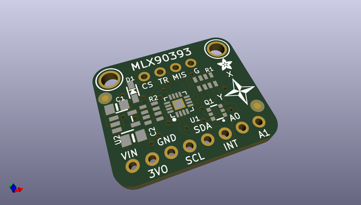
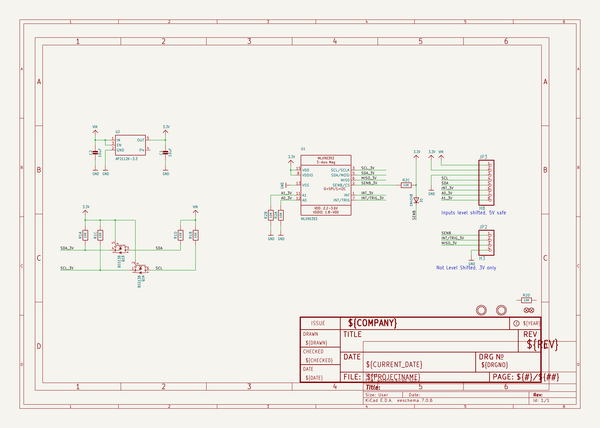
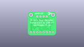
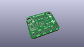
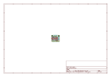
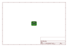
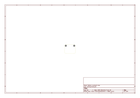
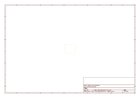
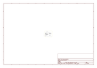

# OOMP Project  
## Adafruit-MLX90393-PCB  by adafruit  
  
oomp key: oomp_projects_flat_adafruit_adafruit_mlx90393_pcb  
(snippet of original readme)  
  
-- Adafruit Wide-Range Triple-axis Magnetometer - MLX90393 PCB  
  
<a href="http://www.adafruit.com/products/4022">   
<a href="http://www.adafruit.com/products/4022">   
Click here to purchase one from the Adafruit shop</a>  
  
PCB files for the Adafruit Wide-Range Triple-axis Magnetometer - MLX90393. Format is EagleCAD schematic and board layout  
* https://www.adafruit.com/product/4022  
  
--- Description  
  
Measure the invisible magnetic fields that surround us, with this wide-range magnetometer. The MLX90393 is a wide range magnetic field sensor, that can measure 16-bits in ranges from ±5mT up to ±50mT in all 3 axes.  
  
Compared to most magnetometers, this gives a huge range, which makes it excellent for detecting magnets and magnetic orientation, rather than the Earth's magnetic field. (Magnets have a much stronger field that overwhelms most magnetometers that would normally be used for orientation with respect to the North Pole)  
  
To make it easy to use, we've placed this tiny little sensor onto a breakout board, with a 3.3V power supply and level shifter. This makes it easy to use with any 3 or 5V microcontroller. Our Arduino and CircuitPython code will get you started in a jiffy, with I2C communication to the sensor. You will be readin' out those Gauss's in minutes! With the address select pins you can have up to 4 sensors on one I2C bus.  
  
Comes as a fully assembled and tested   
  full source readme at [readme_src.md](readme_src.md)  
  
source repo at: [https://github.com/adafruit/Adafruit-MLX90393-PCB](https://github.com/adafruit/Adafruit-MLX90393-PCB)  
## Board  
  
  
## Schematic  
  
  
  
[schematic pdf](working_schematic.pdf)  
## Images  
  
  
  
  
  
  
  
  
  
  
  
  
  
  
  
  
