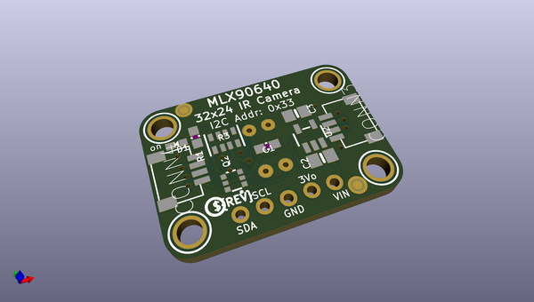
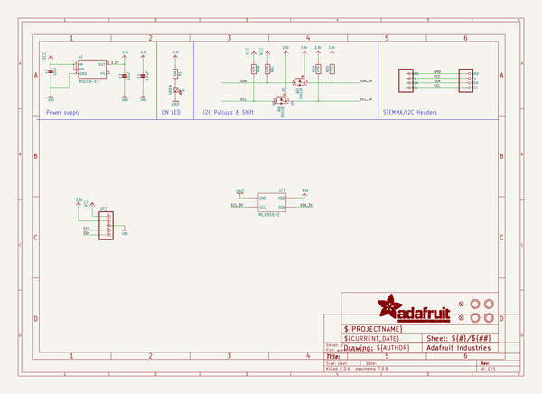
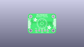
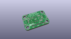
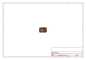
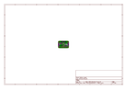
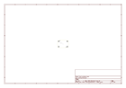
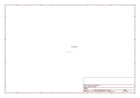

# OOMP Project  
## Adafruit-MLX90640-PCB  by adafruit  
  
oomp key: oomp_projects_flat_adafruit_adafruit_mlx90640_pcb  
(snippet of original readme)  
  
-- Adafruit MLX90640 IR Thermal Camera Breakout PCB  
  
<a href="http://www.adafruit.com/products/4407">   
Click here to purchase one from the Adafruit shop</a>   
<a href="http://www.adafruit.com/products/4469">   
Click here to purchase one from the Adafruit shop</a>  
  
PCB files for the Adafruit MLX90640 IR Thermal Camera Breakout.   
  
Format is EagleCAD schematic and board layout  
* https://www.adafruit.com/product/4407  
* https://www.adafruit.com/product/4469  
  
--- Description  
  
You can now add affordable heat-vision to your project and with an Adafruit MLX90640 Thermal Camera Breakout. This sensor contains a 24x32 array of IR thermal sensors. When connected to your microcontroller (or Raspberry Pi) it will return an array of 768 individual infrared temperature readings over I2C. It's like those fancy thermal cameras, but compact and simple enough for easy integration.  
  
One version has a narrow 55°x35° field of view, and we also have a version with a wider 110°x70° field of view  
  
This part will measure temperatures ranging from -40°C to 300°C with an accuracy of +- 2°C (in the 0-100°C range). With a maximum frame rate of 16 Hz (the theoretical limit is 32Hz but we were not able to practically achieve it), It's perfect for creating your own human detector or mini thermal camera. We have code for using this sensor on an Arduino or compatible (the sensor communicates over I2C) or  
  full source readme at [readme_src.md](readme_src.md)  
  
source repo at: [https://github.com/adafruit/Adafruit-MLX90640-PCB](https://github.com/adafruit/Adafruit-MLX90640-PCB)  
## Board  
  
  
## Schematic  
  
  
  
[schematic pdf](working_schematic.pdf)  
## Images  
  
  
  
  
  
  
  
  
  
  
  
  
  
  
  
  
