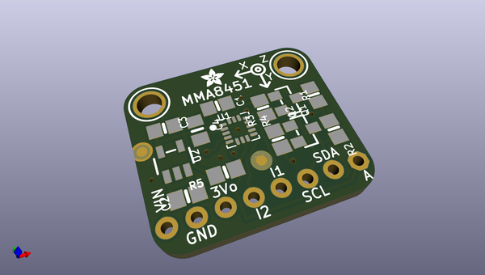
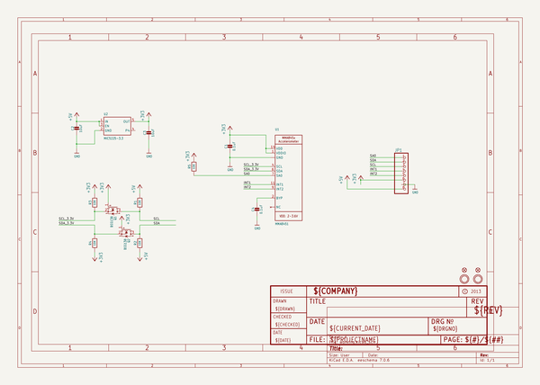
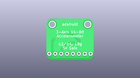
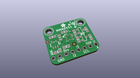
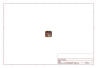
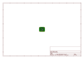
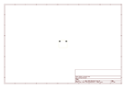
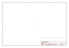
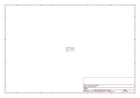

# OOMP Project  
## Adafruit-MMA8451-Breakout-PCB  by adafruit  
  
oomp key: oomp_projects_flat_adafruit_adafruit_mma8451_breakout_pcb  
(snippet of original readme)  
  
-- Adafruit MMA8451 Triple-Axis Accelerometer - ±2/4/8g @ 14-bit Breakout PCB  
<a href="http://www.adafruit.com/products/2019">   
Click here to purchase one from the Adafruit shop</a>  
  
So many accelerometers and so little time! We've expanded our accelerometer selection even more with this high-precision and inexpensive MMA8451 Triple-Axis Accelerometer w/ 14-bit ADC. You can detect motion, tilt and basic orientation with a digital accelerometer - and the MMA8451 is a great accelerometer to start with. It has a wide usage range, from +-2g up to +-8g yet is easy to use with Arduino or another microcontroller  
  
The MMA8451 is a miniature little accelerometer from Freescale, who are (by this point) masters at the accelerometer-design game. It's designed for use in phones, tablets, smart watches, and more, but works just as well in your Arduino project. Of the MMA8451/MMA8452/MMA8453 family, the MMA8451 is the most precise with a built in 14-bit ADC. The accelerometer also has built in tilt/orientation detection so it can tell you whether your project is being held in landscape or portrait mode, and whether it is tilted forward or back  
  
PCB files for the Adafruit MMA8451 Breakout. The format is EagleCAD schematic and board layout  
- https://www.adafruit.com/product/2019  
  
--- License  
  
Adafruit invests time and resources providing this open source design, please support Adafruit and open-source hardware by purchasing products from   
  full source readme at [readme_src.md](readme_src.md)  
  
source repo at: [https://github.com/adafruit/Adafruit-MMA8451-Breakout-PCB](https://github.com/adafruit/Adafruit-MMA8451-Breakout-PCB)  
## Board  
  
  
## Schematic  
  
  
  
[schematic pdf](working_schematic.pdf)  
## Images  
  
  
  
  
  
  
  
  
  
  
  
  
  
  
  
  
