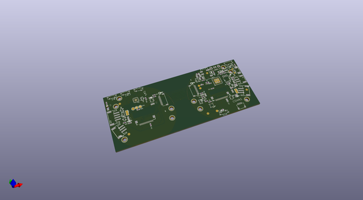

# OOMP Project  
## Adafruit-MONSTER-M4SK-PCB  by adafruit  
  
oomp key: oomp_projects_flat_adafruit_adafruit_monster_m4sk_pcb  
(snippet of original readme)  
  
-- Adafruit Adafruit MONSTER M4SK - DIY Electronic Eyes Mask PCB  
  
<a href="http://www.adafruit.com/products/4343">   
Click here to purchase one from the Adafruit shop</a>  
  
PCB files for the Adafruit Adafruit MONSTER M4SK - DIY Electronic Eyes Mask.   
  
Format is EagleCAD schematic and board layout  
* https://www.adafruit.com/product/4343  
  
--- Description  
  
Peep dis! Have you always wanted to have another pair of eyes on the back of your head? Or outfit your costume with big beautiful orbs? The MONSTER M4SK is like the Hallowing but twice as good, with two gorgeous 240x240 pixel IPS TFT displays, driven by a 120MHZ Cortex M4 processor that can pump out those pixels super fast. You'll get the same quality display as our Raspberry Pi Eyes kit but without needing to tote around a full Linux computer  
  
This unique design has the eyes at the same pupil-distance as a human (~63mm) but is designed so that the nose section can be broken apart with pliers/cutters and then wired together with a 9-pin JST SH cable up to 100mm long so the eyes can be re-positioned or freely attached.  
  
We wanted to make audio-effects easier so in addition to a class D audio amp, there's also a stereo headphone jack that is connected to the two DACs on the chip. Use it when you want an externally sound amplifier box for big effects. For small portable effects, the built-in amp can drive 8 ohm speakers up to 1 Watt.  
  
On each side are JST-PH plugs for connecting  
  full source readme at [readme_src.md](readme_src.md)  
  
source repo at: [https://github.com/adafruit/Adafruit-MONSTER-M4SK-PCB](https://github.com/adafruit/Adafruit-MONSTER-M4SK-PCB)  
## Board  
  
  
## Schematic  
  
  
  
[schematic pdf](working_schematic.pdf)  
## Images  
