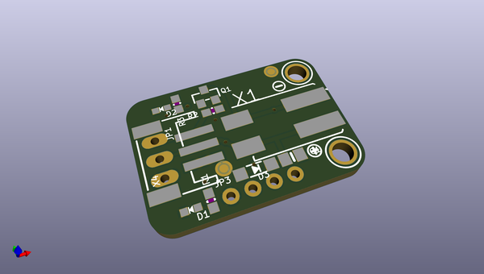
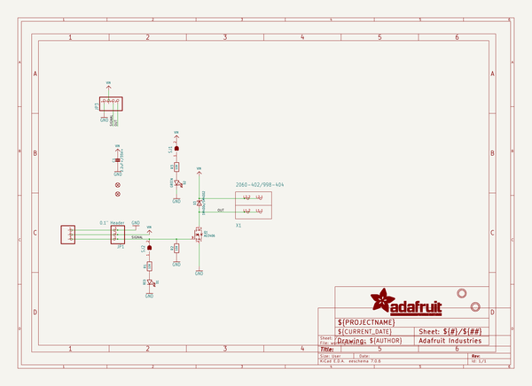
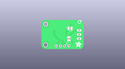
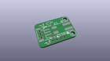
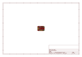
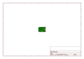
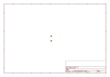
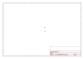
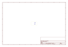
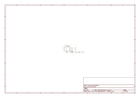

# OOMP Project  
## Adafruit-MOSFET-Driver-STEMMA-PCB  by adafruit  
  
oomp key: oomp_projects_flat_adafruit_adafruit_mosfet_driver_stemma_pcb  
(snippet of original readme)  
  
-- Adafruit Adafruit MOSFET Driver STEMMA PCB  
  
<a href="http://www.adafruit.com/products/5648">   
Click here to purchase one from the Adafruit shop</a>  
  
PCB files for the Adafruit Adafruit MOSFET Driver STEMMA.   
  
Format is EagleCAD schematic and board layout  
* https://www.adafruit.com/product/5648  
  
--- Description  
  
Sparky the Blue Smoke Monster shows up whenever the magic smoke is let of of an electronic component. And his very favorite is whenever folks first start with electronics and robotics: wiring up a motor or solenoid or high power LED is a perfect recipe for getting that blue smoke out of an Arduino or Raspberry Pi. Why? Because these high-current devices can't be connected directly to a GPIO pin on a microcontroller! They need to have a transistor / MOSFET driver, plus a kickback-protection diode that will absorb the inductive 'kick' caused by turning on-and-off motors and solenoids. Without that driver and diode - your tronix will go poof!  
  
We have tutorials on how to wire up the components to create a transistor driver on a breadboard, but its easy to put the diode in backwards, or pick the wrong kind of transistor. And some folks don't want to have the extra breadboard for just controlling a simple motor fan or solenoid. Which is why we designed the Adafruit STEMMA MOSFET Driver for Motors, Solenoids, and LEDs.   
  
This board has a simple plug-and-play JST PH (2mm pitch) input connector for solderless use. Pro  
  full source readme at [readme_src.md](readme_src.md)  
  
source repo at: [https://github.com/adafruit/Adafruit-MOSFET-Driver-STEMMA-PCB](https://github.com/adafruit/Adafruit-MOSFET-Driver-STEMMA-PCB)  
## Board  
  
  
## Schematic  
  
  
  
[schematic pdf](working_schematic.pdf)  
## Images  
  
  
  
  
  
  
  
  
  
  
  
  
  
  
  
  
