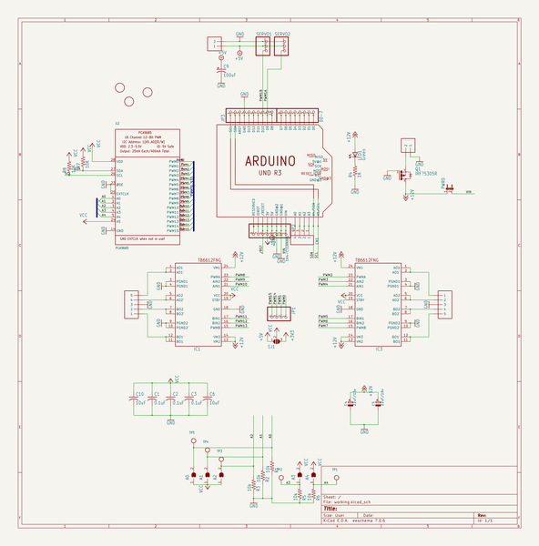
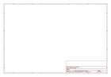

# OOMP Project  
## Adafruit-Motor-Shield-V2-PCB  by adafruit  
  
(snippet of original readme)  
  
-- Adafruit Motor Shield V2 PCB  
  
<a href="http://www.adafruit.com/products/1438">   
Click here to purchase one from the Adafruit shop</a>  
  
PCB files for Adafruit Motor Shield V2.   
- http://www.adafruit.com/products/1438  
  
--- DESCRIPTION  
The original Adafruit Motorshield kit is one of our most beloved kits, which is why we decided to make something even better. We have upgraded the shield kit to make the bestest, easiest way to drive DC and Stepper motors. This shield will make quick work of your next robotics project! We kept the ability to drive up to 4 DC motors or 2 stepper motors, but added many improvements:  
  
Instead of a L293D darlington driver, we now have the TB6612 MOSFET drivers with 1.2A per channel current capability (you can draw up to 3A peak for approx 20ms at a time). It also has much lower voltage drops across the motor so you get more torque out of your batteries, and there are built-in flyback diodes as well.  
  
Instead of using a latch and the Arduino's PWM pins, we have a fully-dedicated PWM driver chip onboard. This chip handles all the motor and speed controls over I2C. Only two data pins (SDA & SCL in addition to the power pins GND & 5V) are required to drive the multiple motors, and since it's I2C you can also connect any other I2C devices or shields to the same pins. This also makes it drop-in compatible with any Arduino, such as the Uno, Due, Leonardo and Mega R3.  
  
Completely stackable design: 5 ad  
  full source readme at [readme_src.md](readme_src.md)  
  
source repo at: [https://github.com/adafruit/Adafruit-Motor-Shield-V2-PCB](https://github.com/adafruit/Adafruit-Motor-Shield-V2-PCB)  
## Board  
  
  
## Schematic  
  
  
  
[schematic pdf](working_schematic.pdf)  
## Images  
  
  
  
  
  
  
  
  
  
  
  
  
  
  
  
  
