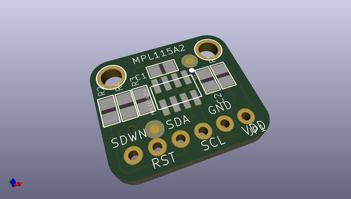
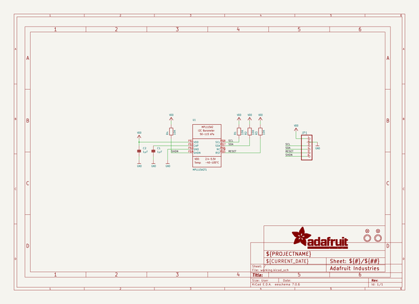
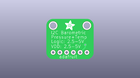
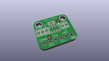
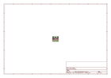
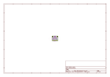
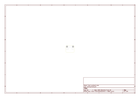

# OOMP Project  
## Adafruit-MPL115A2-Breakout-PCB  by adafruit  
  
oomp key: oomp_projects_flat_adafruit_adafruit_mpl115a2_breakout_pcb  
(snippet of original readme)  
  
-- Adafruit MPL115A2 Breakout PCB  
  
<a href="http://www.adafruit.com/products/992">   
Click here to purchase one from the Adafruit shop  
</a>  
  
PCB files for the Adafruit MPL115A2 Breakout. Format is EagleCAD schematic and board layout  
* https://www.adafruit.com/product/992  
  
--- DESCRIPTION  
This pressure sensor from Freescale is a great low-cost sensing solution for measuring barometric pressure. At 1.5 hPa resolution, it's not as precise as our favorite pressure sensor, the BMx280 series, which has up to 0.03 hPa resolution so we don't suggest it as a precision altimeter. However, it's great for basic barometric pressure sensing. The sensor is soldered onto a PCB with 10K pull-up resistors on the I2C pins.  
  
This chip is good for use with power and logic voltages ranging from 2.4V to 5.5V so you can use it with your 3V or 5V microcontroller. There's a basic temperature sensor inside but there's no specifications in the datasheet so we're not sure how accurate it is.  
  
This chip looks and sounds a whole lot like the MPL3115A2 but this is the less precise version, best for barometric sensing only  
  
Using the sensor is easy. For example, if you're using an Arduino, simply connect the VDD pin to the 5V voltage pin, GND to ground, SCL to I2C Clock (Analog 5 on an UNO) and SDA to I2C Data (Analog 4 on an UNO). Then download our MPL115A2 Arduino library and example code for temperature, pressure and basic altitude calculation. Install  
  full source readme at [readme_src.md](readme_src.md)  
  
source repo at: [https://github.com/adafruit/Adafruit-MPL115A2-Breakout-PCB](https://github.com/adafruit/Adafruit-MPL115A2-Breakout-PCB)  
## Board  
  
  
## Schematic  
  
  
  
[schematic pdf](working_schematic.pdf)  
## Images  
  
  
  
  
  
  
  
  
  
  
  
  
  
  
  
  
