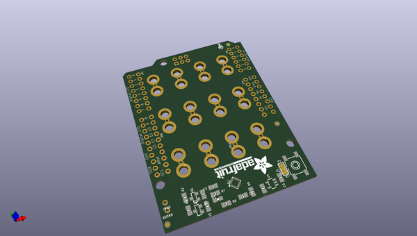
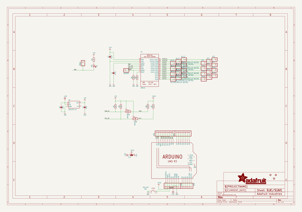
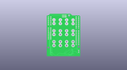
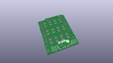
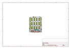
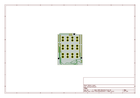
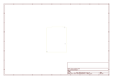
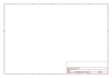
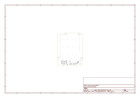

# OOMP Project  
## Adafruit-MPR121-Capacitive-Touch-Shield-PCB  by adafruit  
  
oomp key: oomp_projects_flat_adafruit_adafruit_mpr121_capacitive_touch_shield_pcb  
(snippet of original readme)  
  
-- Adafruit MPR121 Capacitive Touch Shield PCB  
<a href="http://www.adafruit.com/products/2024">   
Click here to purchase one from the Adafruit shop</a>  
  
This touch-able add on shield for Arduinos will inspire your next interactive project with 12 capacitive touch sensors. Capacitive touch sensing works by detecting when a person (or animal) has touched one of the sensor electrodes. Capacitive touch sensing used for stuff like touch-reactive tablets and phones, as well as control panels for appliances, which is where you may have used it before. This shield allows you to create electronics that can react to human touch, with up to 12 individual sensors.  
  
The shield has 12 'figure 8' holes in it that can be gripped onto with alligator clip cables. Attach one side of the clip to the shield and the other side to something electrically conductive (like metal) or full of water (like vegetables or fruit!) Then start up our handy Arduino library to detect when the object is touched. That's pretty much it, very easy! For advanced users, you can also solder to a pad to make a slimmer & more permanent connection. Works great with any Arduino as it only uses the I2C pins (SCL & SDA).  
  
It uses the same chip as our MPR121 12-Key Capacitive Touch Sensor Breakout so you can duplicate the library and code! We have examples for reading touches. Using an Arduino Leonardo and a little bit of creativity you can use it to turn touches into keybo  
  full source readme at [readme_src.md](readme_src.md)  
  
source repo at: [https://github.com/adafruit/Adafruit-MPR121-Capacitive-Touch-Shield-PCB](https://github.com/adafruit/Adafruit-MPR121-Capacitive-Touch-Shield-PCB)  
## Board  
  
  
## Schematic  
  
  
  
[schematic pdf](working_schematic.pdf)  
## Images  
  
  
  
  
  
  
  
  
  
  
  
  
  
  
  
  
