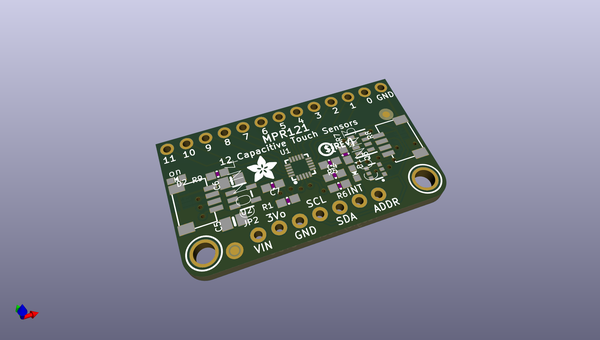
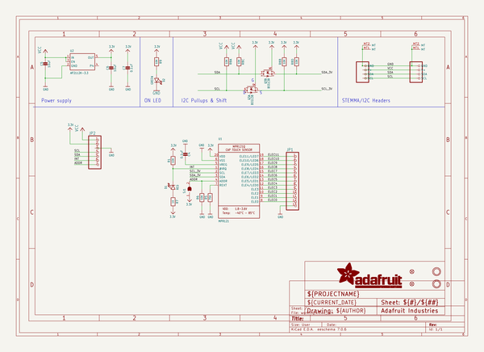
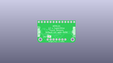
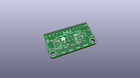
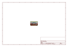
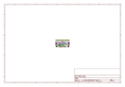
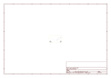
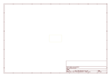
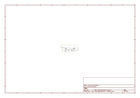

# OOMP Project  
## Adafruit-MPR121-PCB  by adafruit  
  
(snippet of original readme)  
  
-- Adafruit MPR121 capacitive touch breakout PCB  
<a href="http://www.adafruit.com/products/1982">   
Click here to purchase one from the Adafruit shop</a>  
<a href="http://www.adafruit.com/products/4830">   
Click here to purchase one from the Adafruit shop</a>  
  
Add lots of touch sensors to your next microcontroller project with this easy-to-use 12-channel capacitive touch sensor breakout board, starring the MPR121. This chip can handle up to 12 individual touch pads.  
  
The MPR121 has support for only I2C, which can be implemented with nearly any microcontroller. You can select one of 4 addresses with the ADDR pin (or two on the Gator version), for a total of 48 (24 on the Gator version) capacitive touch pads on one I2C 2-wire bus. Using this chip is a lot easier than doing the capacitive sensing with analog inputs: it handles all the filtering for you and can be configured for more/less sensitivity.  
  
This sensor comes as a tiny hard-to-solder chip so we put it onto a breakout board for you. Since it's a 3V-only chip, we added a 3V regulator and I2C level shifting so its safe to use with any 3V or 5V microcontroller/processor like Arduino. We even added an LED onto the IRQ line so it will blink when touches are detected, making debugging by sight a bit easier on you. Comes with a fully assembled board, and a stick of 0.1" header so you can plug it into a breadboard. For conta  
  full source readme at [readme_src.md](readme_src.md)  
  
source repo at: [https://github.com/adafruit/Adafruit-MPR121-PCB](https://github.com/adafruit/Adafruit-MPR121-PCB)  
## Board  
  
  
## Schematic  
  
  
  
[schematic pdf](working_schematic.pdf)  
## Images  
  
  
  
  
  
  
  
  
  
  
  
  
  
  
  
  
