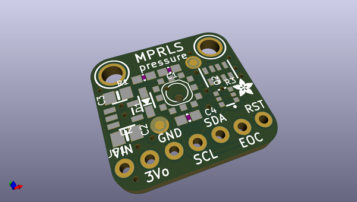
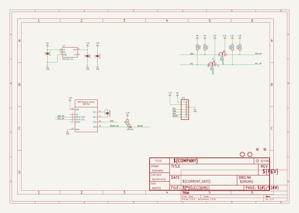
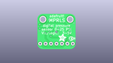
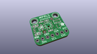
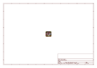
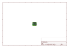
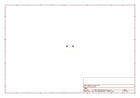
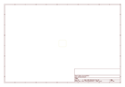
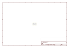

# OOMP Project  
## Adafruit-MPRLS-Pressure-Sensor-Breakout-PCB  by adafruit  
  
oomp key: oomp_projects_flat_adafruit_adafruit_mprls_pressure_sensor_breakout_pcb  
(snippet of original readme)  
  
-- Adafruit MPRLS Ported Pressure Sensor Breakout - 0 to 25 PSI PCB  
  
<a href="http://www.adafruit.com/products/3965">   
Click here to purchase one from the Adafruit shop</a>  
  
PCB files for the Adafruit MPRLS Ported Pressure Sensor Breakout - 0 to 25 PSI. Format is EagleCAD schematic and board layout  
* https://www.adafruit.com/product/3965  
  
--- Description  
  
We stock a few barometric pressure sensors, great for altitude and weather measurements. This pressure sensor is special because it comes with a metal port! Unlike other pressure sensors, you can easily attach a tube to it, to measure air pressure inside a close space. In particular we think this would be a great sensor for use with making DIY assistive tech "Sip & Puff" interfaces, or measuring the pressure within a vacuum chamber or other pressurized container.  
  
Unlike most ported pressure sensors, this one uses I2C, it's really easy to use with any microcontroller. Inside is a silicone-gel covered pressure sensing gauge with a pre-calibrated and compensated 24 bit ADC. We have [example code and libraries for Arduino](https://github.com/adafruit/Adafruit_MPRLS) or [CircuitPython/Python](https://github.com/adafruit/Adafruit_CircuitPython_MPRLS). You can measure absolute pressure 0 to 25 PSI, which is a great range since ambient pressure here on Earth is about 14.5 PSI.  
  
The port is made of stainless steel and is 3.7mm long and 2.5mm diameter. It doesn't come with tubing   
  full source readme at [readme_src.md](readme_src.md)  
  
source repo at: [https://github.com/adafruit/Adafruit-MPRLS-Pressure-Sensor-Breakout-PCB](https://github.com/adafruit/Adafruit-MPRLS-Pressure-Sensor-Breakout-PCB)  
## Board  
  
  
## Schematic  
  
  
  
[schematic pdf](working_schematic.pdf)  
## Images  
  
  
  
  
  
  
  
  
  
  
  
  
  
  
  
  
