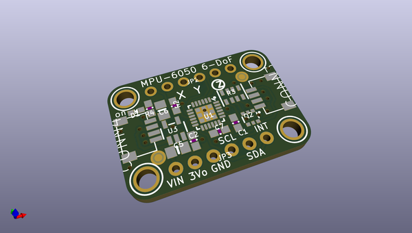
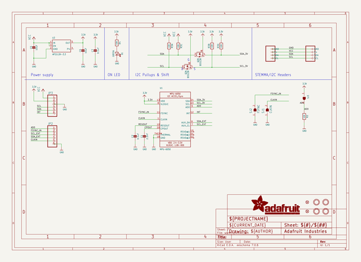
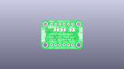
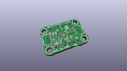
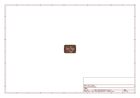
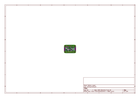
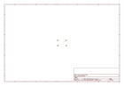
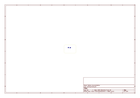
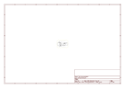

# OOMP Project  
## Adafruit-MPU6050-PCB  by adafruit  
  
(snippet of original readme)  
  
-- Adafruit MPU6050 6-DoF Accelerometer and Gyro PCB  
  
<a href="http://www.adafruit.com/products/3886">   
Click here to purchase one from the Adafruit shop</a>  
  
PCB files for the Adafruit MPU6050 6-DoF Accelerometer and Gyro.   
  
Format is EagleCAD schematic and board layout  
* https://www.adafruit.com/product/3886  
  
--- Description  
  
The MPU-6050 is a popular six DoF accelerometer and gyroscope (gyro) that has all the info you need on how things are shakin' and spinnin' . With six axes of sensing and 16-bit measurements, you'll have everything you need to give your robot friend an inner ear.  
  
This combination of gyroscopes and accelerometers is commonly referred to as an **I**nertial **M**easurement **U**nit or IMU. Not so long ago IMUs were the [size of a breadbox](http://mentalfloss.com/article/55835/how-big-breadbox) and cost upwards of **$50,000!** While you're not going to be using it to guide your mars rocket, the MPU-6050 is several orders of magnitude smaller and a bargain at a price three orders of magnitude less!  Now you can add telemetry to your [water rocket](https://en.wikipedia.org/wiki/Water_rocket) (with some waterproofing).  
  
As with all Adafruit breakouts, we've done the work to make this handy temperature helper super easy to use. We've put it on a breakout board with the required support circuitry and connectors to make it easy to work with, and is now a trend we've added [SparkFun Qwiic](https://www.sparkfun  
  full source readme at [readme_src.md](readme_src.md)  
  
source repo at: [https://github.com/adafruit/Adafruit-MPU6050-PCB](https://github.com/adafruit/Adafruit-MPU6050-PCB)  
## Board  
  
  
## Schematic  
  
  
  
[schematic pdf](working_schematic.pdf)  
## Images  
  
  
  
  
  
  
  
  
  
  
  
  
  
  
  
  
