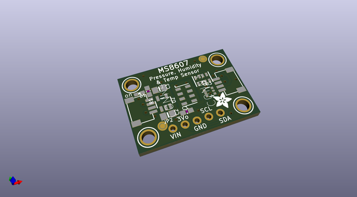
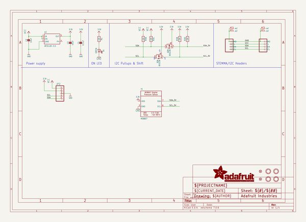
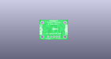
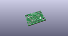
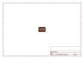
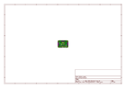
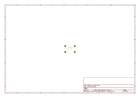
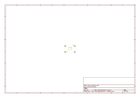
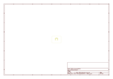
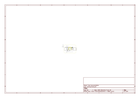

# OOMP Project  
## Adafruit-MS8607-PCB  by adafruit  
  
(snippet of original readme)  
  
-- Adafruit MS8607 PTH Sensor PCB  
  
<a href="http://www.adafruit.com/products/4716">   
Click here to purchase one from the Adafruit shop</a>  
  
PCB files for the Adafruit MS8607 PTH Sensor.   
  
Format is EagleCAD schematic and board layout  
* https://www.adafruit.com/product/4716  
  
--- Description  
  
Because of their many applications, Pressure, Temperature, and Humidity sensors (PHT sensors) are a common offering from semiconductor companies. The MS8607 PHT sensor from TE Connectivity  does an admirable job of measuring a wide range of all three environmental conditions. Each and every MS8607 sensor is calibrated at the factory and the calibration constants stored in the sensor itself. This sensor is a one stop shop for all your common weather and environmental related metrics. Just add a MS8607 and you’ll be ready to finish your enclosure and retire as a [Dubia Cockroach Farmer](https://dubiaroachdepot.com/guidance/breeding-dubia-roaches-thermometer)  
  
The MS8607 provides the previously mentioned factory-calibrated pressure, temperature, and humidity data are recorded as **16-bit** values and made available over an I2C bus for simple, two wire (plus power and ground!) connection to your microcontroller. Pressure measurements accuracy comes in at **+/- 2 hPa**, relative humidity at **+/- 3% rH**, and temperature is good to within 1 degree Celsius. One standout feature of the MS8607 is it’s very respectable low power consumption at   
  full source readme at [readme_src.md](readme_src.md)  
  
source repo at: [https://github.com/adafruit/Adafruit-MS8607-PCB](https://github.com/adafruit/Adafruit-MS8607-PCB)  
## Board  
  
  
## Schematic  
  
  
  
[schematic pdf](working_schematic.pdf)  
## Images  
  
  
  
  
  
  
  
  
  
  
  
  
  
  
  
  
