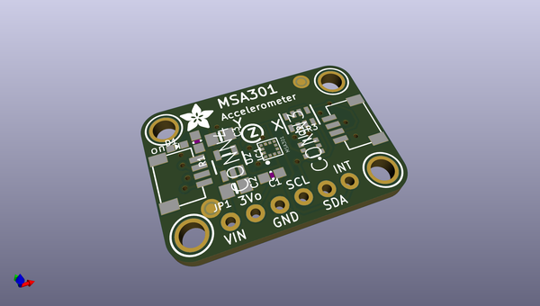
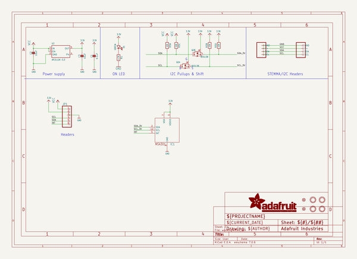
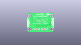
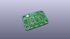
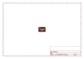
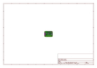
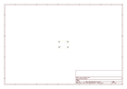
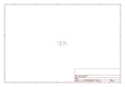

# OOMP Project  
## Adafruit-MSA301-PCB  by adafruit  
  
(snippet of original readme)  
  
-- Adafruit MSA301 Triple Axis Accelerometer PCB  
  
<a href="http://www.adafruit.com/products/4344">   
Click here to purchase one from the Adafruit shop</a>  
  
PCB files for the Adafruit MSA301 Triple Axis Accelerometer.   
  
Format is EagleCAD schematic and board layout  
* https://www.adafruit.com/product/4344  
  
--- Description  
  
The MSA301 is a super small and low cost **triple-axis accelerometer**. It's inexpensive, but has just about every 'extra' you'd want in an accelerometer:  
  
* Three axis sensing, 14-bit resolution  
* ±2g/±4g/±8g/±16g selectable scaling  
* I2C interface on fixed I2C address 0x26  
* Interrupt output  
* Multiple data rate options 1 Hz to 500 Hz  
* As low as 2uA current draw in low power mode (just the chip itself, not including any supporting circuitry)  
* Tap, Double-tap, orientation & freefall detection  
To make life easier so you can focus on your important work, we've taken the MSA301 and put it onto a breakout PCB along with support circuitry to let you use this little wonder with 3.3V (Feather/Raspberry Pi) or 5V (Arduino/ Metro328) logic levels. Additionally since it speaks I2C you can easily connect it up with two wires (plus power and ground!).  We've even included [SparkFun qwiic](https://www.sparkfun.com/qwiic) compatible [STEMMA QT](https://learn.adafruit.com/introducing-adafruit-stemma-qt) connectors for the I2C bus so **you don't even need to solder!** Just wire up to your favorite micro and you can use   
  full source readme at [readme_src.md](readme_src.md)  
  
source repo at: [https://github.com/adafruit/Adafruit-MSA301-PCB](https://github.com/adafruit/Adafruit-MSA301-PCB)  
## Board  
  
  
## Schematic  
  
  
  
[schematic pdf](working_schematic.pdf)  
## Images  
  
  
  
  
  
  
  
  
  
  
  
  
  
  
  
  
